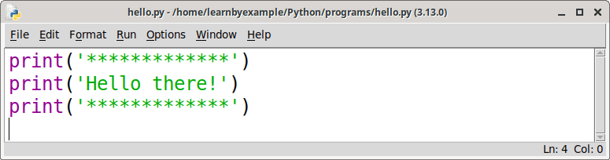
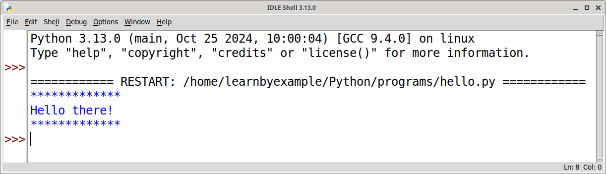
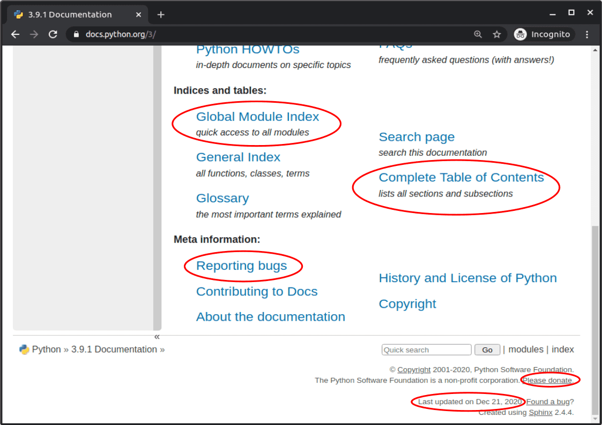
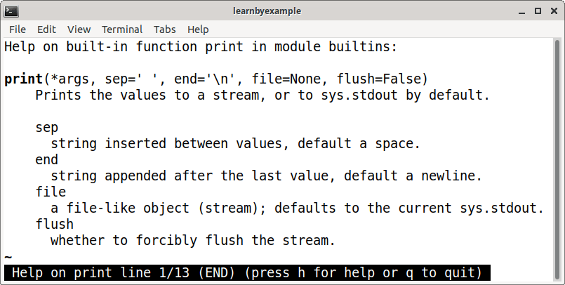
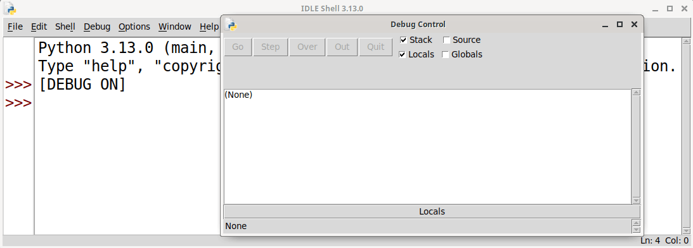
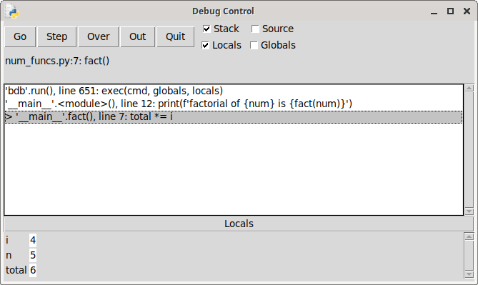
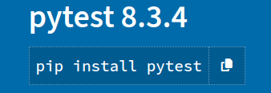

# Preface

This book is a short, introductory guide for the Python programming language.

## Prerequisites

You should be already familiar with basic programming concepts. If you are new to programming, I'd highly recommended these resources to get started:

* [Think Python](https://greenteapress.com/wp/think-python-2e/) — gives you a solid foundation to programming, teaches debugging right the beginning, includes case studies, exercises, etc
* [Automate the Boring Stuff with Python](https://automatetheboringstuff.com/2e/) — teaches you programming concepts and then shows how to automate everyday problems

Or, if you prefer certification courses:

* [Harvard CS50: Introduction to Computer Science](https://www.edx.org/course/cs50s-introduction-to-computer-science) — self paced course on edx. Languages include C, Python, SQL, and JavaScript plus CSS and HTML
* [MIT: Introduction to Computer Science and Programming Using Python](https://www.edx.org/course/introduction-to-computer-science-and-programming-7) — self paced course on edx

See my curated list [py_resources](https://learnbyexample.github.io/py_resources/) for many more learning resources on various Python topics.

## Conventions

* The examples presented here have been tested with **Python version 3.9.0** and includes features that are not available in earlier versions.
* Code snippets that are copy pasted from the Python REPL shell have been modified for presentation purposes. For example, comments to provide context and explanations, blank lines and shortened error messages to improve readability and so on.
* A comment with filename will be shown as the first line for program files.
* External links are provided for further exploration throughout the book. They have been chosen with care to provide resources with more detailed discussion on those topics.

## Acknowledgements

* [Offical Python website](https://docs.python.org/3/) — documentation and examples
* [stackoverflow](https://stackoverflow.com/) and [unix.stackexchange](https://unix.stackexchange.com/) — for getting answers to pertinent questions on Python, Shell and programming in general
* [/r/learnpython](https://www.reddit.com/r/learnpython) — helpful forum for beginners
* [/r/Python/](https://www.reddit.com/r/Python/) — general Python discussion
* [tex.stackexchange](https://tex.stackexchange.com/) — for help on `pandoc` and `tex` related questions
* [LibreOffice Draw](https://www.libreoffice.org/discover/draw/) — cover image
* [pngquant](https://pngquant.org/) and [svgcleaner](https://github.com/RazrFalcon/svgcleaner) for optimizing images
* [Warning](https://commons.wikimedia.org/wiki/File:Warning_icon.svg) and [Info](https://commons.wikimedia.org/wiki/File:Info_icon_002.svg) icons by [Amada44](https://commons.wikimedia.org/wiki/User:Amada44) under public domain

## Feedback and Errata

I would highly appreciate if you'd let me know how you felt about this book, it would help to improve this book as well as my future attempts. Also, please do let me know if you spot any error or typo.

Issue Manager: [https://github.com/learnbyexample/100_page_python_intro/issues](https://github.com/learnbyexample/100_page_python_intro/issues)

E-mail: learnbyexample.net@gmail.com

Twitter: https://twitter.com/learn_byexample

## Author info

Sundeep Agarwal is a freelance trainer, author and mentor. His previous experience includes working as a Design Engineer at Analog Devices for more than 5 years. You can find his other works, primarily focused on Linux command line, text processing, scripting languages and curated lists, at [https://github.com/learnbyexample](https://github.com/learnbyexample). He has also been a technical reviewer for [Command Line Fundamentals](https://www.packtpub.com/application-development/command-line-fundamentals) book and video course published by Packt.

**List of books:** https://learnbyexample.github.io/books/

## License

This work is licensed under a
[Creative Commons Attribution-NonCommercial-ShareAlike 4.0 International License](https://creativecommons.org/licenses/by-nc-sa/4.0/)

Code snippets are available under [MIT License](https://github.com/learnbyexample/100_page_python_intro/blob/main/LICENSE)

Images mentioned in Acknowledgements section above are available under original licenses.

## Book version

1.0

# Introduction

[Wikipedia](https://en.wikipedia.org/wiki/Python_(programming_language)) does a great job of describing about Python in a few words. So, I'll just copy-paste relevant information here:

>Python is an interpreted, high-level and general-purpose programming language. Python's design philosophy emphasizes code readability with its notable use of significant whitespace. Its language constructs and object-oriented approach aim to help programmers write clear, logical code for small and large-scale projects.
>
>Python is dynamically typed and garbage-collected. It supports multiple programming paradigms, including structured (particularly, procedural), object-oriented, and functional programming. Python is often described as a "batteries included" language due to its comprehensive standard library.
>
>As of December 2020 Python ranked third in TIOBE’s index of most popular programming languages, behind `C` and `Java`.

> See also [docs.python: General Python FAQ](https://docs.python.org/3/faq/general.html) for answers to questions like "What is Python?", "What is Python good for?", "Why is it called Python?", etc.

## Installation

On modern Linux distributions, you are likely to find Python already installed. It may be a few versions behind, but should work just fine for most of the topics covered in this book. To get the exact version used here, visit [Python downloads page](https://www.python.org/downloads/) and install using the appropriate source for your operating system. Should you face any issues in installing, search online for a solution. Yes, that is something I expect you should be able to do as a prerequisite for this book, i.e. you should have prior experience with basic programming and computer usage.

> See [docs.python: What's New](https://docs.python.org/3/whatsnew/index.html) to track changes across versions. As mentioned in the Preface chapter, **3.9.0** is the version used in this book.

## Online tools

In case you are facing installation issues, or do not want to install Python on your computer for some reason, there are plenty of options to execute Python programs using online tools. Some of the popular ones are listed below:

* [Repl.it](https://repl.it/languages/python3) — Interactive playground. Code, collaborate, compile, run, share, and deploy Python and more online from your browser
* [Pythontutor](http://www.pythontutor.com/visualize.html#mode=edit) — Visualize code execution, also has example codes and ability to share sessions
* [PythonAnywhere](https://www.pythonanywhere.com/) — Host, run, and code Python in the cloud

The [offical Python website](https://www.python.org/) also has a *Launch Interactive Shell* option ([https://www.python.org/shell/](https://www.python.org/shell/)), which gives access to a REPL session.

## First program

It is customary to start learning a new programming language by printing a simple phrase. Create a new directory, say `Python/programs` for this book. Then, create a plain text file named `hello.py` with your favorite text editor and type the following piece of code.

```ruby
# hello.py
print('*************')
print('Hello there!')
print('*************')
```

If you are familiar with using command line on a Unix-like system, run the script as shown below. Other options to execute a Python program will be discussed in the next section.

```bash
$ python3.9 hello.py
*************
Hello there!
*************
```

A few things to note here. The first line is a comment, used here to indicate the name of the Python program. `print()` is a built-in function, which can be used without having to load some library. A single string argument has been used for each of the three invocations. `print()` automatically appends a newline character by default. The program ran without a compilation step. As quoted earlier, Python is an *interpreted* language. More details will be discussed in later chapters.

> All the Python programs discussed in this book, along with related text files, can be accessed from my GitHub repo [learnbyexample: 100_page_python_intro](https://github.com/learnbyexample/100_page_python_intro/tree/main/programs). However, I highly recommend typing the programs manually by yourself.

## IDE and text editors

An **integrated development environment** (IDE) might suit you better if you are not comfortable with the command line. IDE provides features likes debugging, syntax highlighting, autocompletion, code refactoring and so on. They also help in setting up **virtual environment** to manage different versions of Python and modules (more on that later).

If you install Python on Windows, it will automatically include **IDLE**, an IDE built using Python's `tkinter` module. On Linux, see if you already have the program `idle3.9`. Otherwise you may have to install it separately, for example, `sudo apt install idle-python3.9` on Ubuntu.

When you open IDLE, you'll get a Python shell (discussed in the next section). For now, click the **New File** option under **File** menu to open a text editor. Type the short program `hello.py` discussed in the previous section. After saving the code, press **F5** to run it. You'll see the results in the shell window.

Screenshots from the text editor and the Python shell are shown below.





Popular alternatives to IDLE are listed below:

* [Thonny](https://thonny.org/) — Python IDE for beginners, lots of handy features like viewing variables, debugger, step through, highlight syntax errors, name completion, etc
* [Pycharm](https://www.jetbrains.com/pycharm/) — smart code completion, code inspections, on-the-fly error highlighting and quick-fixes, automated code refactorings, rich navigation capabilities, support for frameworks, etc
* [Spyder](https://www.spyder-ide.org/) — typically used for scientific computing
* [Jupyter](https://jupyter.org/) — web application that allows you to create and share documents that contain live code, equations, visualizations and narrative text
* [VSCodium](https://vscodium.com/) — community-driven, freely-licensed binary distribution of VSCode
* [Vim](https://github.com/vim/vim), [Emacs](https://www.gnu.org/software/emacs/), [Geany](https://www.geany.org/), [Gedit](https://wiki.gnome.org/Apps/Gedit) — text editors with support for syntax highlighting and more

## REPL

One of the best features of Python is the interactive shell. Such shells are also referred to as REPL, which is an abbreviation for **R**ead **E**valuate **P**rint **L**oop. The Python REPL makes it easy for beginners to try out code snippets for learning purposes. Beyond learning, it is also useful for developing a program in small steps, debugging a large program by trying out few lines of code at a time and so on. REPL will be used frequently in this book to show code snippets.

When you launch Python from the command line, or open IDLE, you get a shell that is ready for user input after the `>>>` prompt.

```bash
$ python3.9
Python 3.9.0 (default, Dec  2 2020, 10:42:13) 
[GCC 5.4.0 20160609] on linux
Type "help", "copyright", "credits" or "license" for more information.
>>> 
```

Try the below instructions. The first one displays a greeting using the `print()` function. Then, a user defined variable is used to store a string value. To display the value, you can either use `print()` again or just type the variable name. Expression results are immediately displayed in the shell. Name of a variable by itself is a valid expression. This behavior is unique to the REPL and an expression by itself won't display anything when used inside a script.

```ruby
>>> print('have a nice day')
have a nice day

>>> username = 'learnbyexample'
>>> print(username)
learnbyexample

# use # to start a single line comment
# note that string representation is shown instead of actual value
# details will be discussed later
>>> username
'learnbyexample'

# use exit() to close the shell, can also use Ctrl+D shortcut
>>> exit()
```

I'll stress again the importance of following along the code snippets by manually typing them on your computer. Programming requires hands-on experience too, reading alone isn't enough. As an analogy, can you learn to drive a car by just reading about it? Since one of the prerequisite is that you should already be familiar with programming basics, I'll extend the analogy to learning to drive a different car model. Or, perhaps a different vehicle such as a truck or a bus might be more appropriate here.

> Depending on the command line shell you are using, you might have the `readline` library that makes it easier to use the REPL. For example, `up` and `down` arrow keys to browse code history, re-execute them (after editing if necessary), search history, autocomplete based on first few characters and so on. See [wikipedia: GNU readline](https://en.wikipedia.org/wiki/GNU_Readline) and [wiki.archlinux: readline](https://wiki.archlinux.org/index.php/readline) for more information.

> You can use `python3.9 -q` to avoid *version and copyright messages* when you start an interactive shell. Use `python3.9 -h` or visit [docs.python: Command line and environment](https://docs.python.org/3/using/cmdline.html) for documentation on cli options.

## Documentation and getting help

The offical Python website has an extensive documentation located at [https://docs.python.org/3/](https://docs.python.org/3/). This includes a tutorial, which is much more comprehensive than the contents presented in this book, several guides for specific modules like `re` and `argparse` and various other information.

Here's a couple of annotated screenshots:




Python provides a `help()` function, which is quite handy to use from the REPL. If you type `help(print)` and press the Enter key, you'll get a screen as shown below. If you are using IDLE, the output would be displayed on the same screen. Otherwise, the content might be shown on a different screen depending on your `pager` settings. Typically, pressing the `q` key will quit the `pager` and get you back to the shell.



If you get stuck with a problem, there are several ways to get it resolved. For example:

1. read/search for that particular topic from documentation/books/tutorials/etc 
2. reduce the code as much as possible so that you are left with minimal code necessary to reproduce the issue
3. talk about the problem with a friend/colleague/inanimate-objects/etc (see [Rubber duck debugging](https://rubberduckdebugging.com/))
4. search about the problem online

You can also ask for help on forums. Make sure to read the instructions provided by the respective forums before asking a question. See also [how to ask smart-questions](http://catb.org/~esr/faqs/smart-questions.html#before). Here's some forums you can use:

* [/r/learnpython](https://www.reddit.com/r/learnpython) and [/r/learnprogramming/](https://www.reddit.com/r/learnprogramming/) — beginner friendly
* [python-forum](https://python-forum.io/) — dedicated Python forum, encourages back and forth discussions based on the topic of the thread
* [/r/Python/](https://www.reddit.com/r/Python/) — general Python discussion
* [stackoverflow: python tag](https://stackoverflow.com/tags/python)

> The [Debugging](#debugging) chapter will discuss more on this topic.

# Numeric data types

Python is a dynamically typed language. The interpreter infers the data type of a value based on pre-determined rules. In the previous chapter, **string** values were coded using single quotes around a sequence of characters. Similarly, there are rules by which you can declare different numeric data types.

## int

Integer numbers are made up of digits `0` to `9` and can be prefixed with **unary** operators like `+` or `-`. There is no restriction to the size of numbers that can be used, only limited by the memory available on your system. Here's some examples:

```ruby
>>> 42
42
>>> 0
0
>>> +100
100
>>> -5
-5
```

For readability purposes, you can use underscores in between the digits.

```ruby
>>> 1_000_000_000
1000000000
```

> Underscore cannot be used as the first or last character, and cannot be used consecutively.

## float

Here's some examples for floating-point numbers.

```ruby
>>> 3.14
3.14
>>> -1.12
-1.12
```

Python also supports the exponential notation. See [wikipedia: E scientific notation](https://en.wikipedia.org/wiki/Scientific_notation#E_notation) for details about this form of expressing numbers.

```ruby
>>> 543.15e20
5.4315e+22
>>> 1.5e-5
1.5e-05
```

Unlike integers, floating-point numbers have a limited precision. Python will automatically convert very small or very large floating-point numbers to the exponential notation.

```ruby
>>> 0.0000000001234567890123456789
1.2345678901234568e-10
>>> 31415926535897935809629384623048923.649234324234
3.1415926535897936e+34
```

> You might also get seemingly strange results as shown below. See [docs.python: Floating Point Arithmetic Issues and Limitations](https://docs.python.org/3/tutorial/floatingpoint.html) and [stackoverflow: Is floating point math broken?](https://stackoverflow.com/questions/588004/is-floating-point-math-broken) for details and workarounds.

```ruby
>>> 3.14 + 2
5.140000000000001
```

## Arithmetic operators

All arithmetic operators you'd typically expect are available. If any operand is a floating-point number, result will be of `float` data type. Use `+` for addition, `-` for subtraction, `*` for multiplication and `**` for exponentiation. As mentioned before, REPL is quite useful for learning purposes. It makes for a good calculator for number crunching as well. You can also use `_` to refer to the result of the previous expression (this is applicable only in the REPL, not in Python scripts).

```ruby
>>> 25 + 17
42
>>> 10 - 8
2
>>> 25 * 3.3
82.5
>>> 32 ** 42
1645504557321206042154969182557350504982735865633579863348609024

>>> 5 + 2
7
>>> _ * 3
21
```

There are two operators for division. Use `/` if you want a floating-point result. Using `//` between two integers will give only the integer portion of the result (no rounding).

```ruby
>>> 4.5 / 1.5
3.0
>>> 5 / 3
1.6666666666666667
>>> 5 // 3
1
```

Use modulo operator `%` to get the remainder. Sign of the result is same as the sign of the second operand.

```ruby
>>> 5 % 3
2

>>> -5 % 3
1
>>> 5 % -3
-1
>>> 6.5 % -3
-2.5
```

> See [docs.python: Binary arithmetic operations](https://docs.python.org/3/reference/expressions.html#binary-arithmetic-operations) and [stackoverflow: modulo operation on negative numbers](https://stackoverflow.com/questions/3883004/the-modulo-operation-on-negative-numbers-in-python) for more details.

Arithmetic operator precedence follows the familiar **PEMDAS** or **BODMAS** abbreviations. Precedence, higher to lower is listed below:

* Expression inside parentheses
* exponentiation
* multiplication, division, modulo
* addition, subtraction

Expression is evaluated left-to-right when operators have the same precedence. Unary operator precedence is between exponentiation and multiplication/division operators. See [docs.python: Operator precedence](https://docs.python.org/3/reference/expressions.html#operator-precedence) for complete details.

## Integer formats

The integer examples so far have been coded using base 10, i.e. **decimal** format. Python has provision for representing **binary**, **octal** and **hexadecimal** formats as well. To distinguish between these different formats, a prefix is used.

* `0b` or `0B` for binary
* `0o` or `0O` for octal
* `0x` or `0X` for hexadecimal

All four formats fall under the `int` data type. Underscores can be used for readability for any of these formats.

```ruby
>>> 0b1000_1111
143
>>> 0o10
8
>>> 0x10
16

>>> 5 + 0xa
15
```

As a consequence, decimal format numbers cannot be prefixed by `0`, other than `0` itself.

```ruby
>>> 00000
0

>>> 09
  File "<stdin>", line 1
    09
     ^
SyntaxError: leading zeros in decimal integer literals are not permitted;
             use an 0o prefix for octal integers
```

If code execution hits a snag, you'll get an error message along with the code snippet that the interpreter thinks caused the issue. In Python parlance, an **exception** has occurred. The exception has a name (`SyntaxError` in the above example) followed by the error message. See [Exception handling](#exception-handling) chapter for more details.

## Other numeric types

Python's standard data type also includes complex type (imaginary part is suffixed with the character `j`). Others like `decimal` and `fractions` are provided as modules.

* [docs.python: complex](https://docs.python.org/3/library/stdtypes.html#typesnumeric)
* [docs.python: decimal](https://docs.python.org/3/library/decimal.html)
* [docs.python: fractions](https://docs.python.org/3/library/fractions.html)

> Some of the numeric types can have alphabets like `e`, `b`, `j`, etc in their values. As Python is a dynamically typed language, you cannot use variable names beginning with a number. Otherwise, it would be impossible to evaluate an expression like `result = initial_value + 0x12 - 2j`.

> There are many third-party libraries that are useful for number crunching in mathematical context, engineering applications, etc. See my list [py_resources: Scientific computing](https://learnbyexample.github.io/py_resources/domain.html#scientific-computing) for curated resources.

# Strings and user input

This chapter will discuss various ways to specify string literals. After that, you'll see how to get input data from the user and handle type conversions.

## Single and double quoted strings

The most common way to declare string literals is by enclosing a sequence of characters within single or double quotes. Unlike other scripting languages like **Bash**, **Perl** and **Ruby**, there is no feature difference between these forms. Idiomatically, single quotes are preferred and other variations are used when needed.

REPL will again be used predominantly in this chapter. One important detail to note is that the result of an expression is displayed using the syntax of that particular data type. Use `print()` function when you want to see how a string literal looks visually.

```ruby
>>> 'hello'
'hello'

>>> print("world")
world
```

If the string literal itself contains single or double quote characters, the other form can be used.

```ruby
>>> print('"Will you come?" he asked.')
"Will you come?" he asked.

>>> print("it's a fine sunny day")
it's a fine sunny day
```

What to do if a string literal has both single and double quotes? You can use the `\` character to escape the quote characters. In the below examples, `\'` and `\"` will evaluate to `'` and `"` characters respectively, instead of prematurely terminating the string definition. Use `\\` if a literal backslash character is needed.

```ruby
>>> print('"It\'s so pretty!" can I get one?')
"It's so pretty!" can I get one?

>>> print("\"It's so pretty!\" can I get one?")
"It's so pretty!" can I get one?
```

In general, the backslash character is used to construct escape sequences. For example, `\n` represents the newline character, `\t` is for tab character and so on. You can use `\ooo` and `\xhh` to represent 256 characters in octal and hexadecimal formats respectively. For Unicode characters, you can use `\N{name}`, `\uxxxx` and `\Uxxxxxxxx` formats. See [docs.python: String and Bytes literals](https://docs.python.org/3/reference/lexical_analysis.html#strings) for full list of escape sequences and details about undefined ones.

```ruby
>>> greeting = 'hi there.\nhow are you?'
>>> greeting
'hi there.\nhow are you?'
>>> print(greeting)
hi there.
how are you?

>>> print('item\tquantity')
item    quantity

>>> print('\u03b1\u03bb\u03b5\N{LATIN SMALL LETTER TURNED DELTA}')
αλεƍ
```

## Triple quoted strings

You can also declare multiline strings by enclosing the value with three single/double quote characters. If backslash is the last character of a line, then a newline won't be inserted at that position. Here's a Python program named `triple_quotes.py` to illustrate this concept.

```ruby
# triple_quotes.py
print('''hi there.
how are you?''')

student = '''\
Name:\tlearnbyexample
Age:\t25
Dept:\tCSE'''

print(student)
```

Here's the output of the above script:

```bash
$ python3.9 triple_quotes.py
hi there.
how are you?
Name:   learnbyexample
Age:    25
Dept:   CSE
```

> See [Docstrings](#docstrings) section for another use of triple quoted strings.

## Raw strings

For certain cases, escape sequences would be too much of a hindrance to workaround. For example, filepaths in Windows use `\` as the delimiter. Another would be regular expressions, where the backslash character has yet another special meaning. Python provides a **raw** string syntax, where all the characters are treated literally. This form, also known as **r-strings** for short, requires a `r` or `R` character prefix to quoted strings. Forms like triple quoted strings and raw strings are for user convenience. Internally, there's just a single representation for string literals. 

```ruby
>>> print(r'item\tquantity')
item\tquantity

>>> r'item\tquantity'
'item\\tquantity'
>>> r'C:\Documents\blog\monsoon_trip.txt'
'C:\\Documents\\blog\\monsoon_trip.txt'
```

Here's an example with `re` built-in module. The `import` statement used below will be discussed in [Importing and creating modules](#importing-and-creating-modules) chapter. See my book [Python re(gex)?](https://github.com/learnbyexample/py_regular_expressions) for details on regular expressions.

```ruby
>>> import re

# numbers >= 100 with optional leading zeros
>>> re.findall(r'\b0*[1-9]\d{2,}\b', '0501 035 154 12 26 98234')
['0501', '154', '98234']

# without raw strings
>>> re.findall('\\b0*[1-9]\d{2,}\\b', '0501 035 154 12 26 98234')
['0501', '154', '98234']
```

## String operators

Python provides a wide variety of features to work with strings. This chapter introduces some of them, like the `+` and `*` operators in this section. Here's some examples to concatenate strings using the `+` operator. The operands can be any expression that results in a string value and you can use any of the different ways to specify a string literal.

```ruby
>>> str1 = 'hello'
>>> str2 = ' world'
>>> str3 = str1 + str2
>>> print(str3)
hello world

>>> str3 + r'. 1\n2'
'hello world. 1\\n2'
```

Another way to concatenate is to simply place any kind of string literal next to each other. You can use zero or more whitespaces between the two literals. But you cannot mix an expression and a string literal. If the strings are inside parentheses, you can also use newline to separate the literals and optionally use comments.

```ruby
>>> 'hello' r' 1\n2\\3'
'hello 1\\n2\\\\3'

# note that ... is REPL's indication for multiline statements, blocks, etc
>>> print('hi '
... 'there')
hi there
```

You can repeat a string by using the `*` operator between a string and an integer.

```ruby
>>> style_char = '-'
>>> print(style_char * 50)
--------------------------------------------------
>>> word = 'buffalo '
>>> print(8 * word)
buffalo buffalo buffalo buffalo buffalo buffalo buffalo buffalo 
```

## String formatting

As per [PEP 20: The Zen of Python](https://www.python.org/dev/peps/pep-0020/),

>There should be one-- and preferably only one --obvious way to do it.

However, there are several approaches for formatting strings. This section will primarily discuss **formatted** string literals (**f-strings** for short). And then show alternate approaches.

f-strings allow you to embed an expression within `{}` characters as part of the string literal. Like raw strings, you need to use a prefix, which is `f` or `F` in this case. Python will substitute the embeds with the result of the expression, converting it to string if necessary (such as numeric results). See [docs.python: Format String Syntax](https://docs.python.org/3/library/string.html#formatstrings) and [docs.python: Formatted string literals](https://docs.python.org/3/reference/lexical_analysis.html#formatted-string-literals) for documentation and more examples.

```ruby
>>> str1 = 'hello'
>>> str2 = ' world'
>>> f'{str1}{str2}'
'hello world'

>>> f'{str1}({str2 * 3})'
'hello( world world world)'
```

A recent feature allows you to add `=` after an expression to get both the expression and the result in the output.

```ruby
>>> num1 = 42
>>> num2 = 7

>>> f'{num1 + num2 = }'
'num1 + num2 = 49'
>>> f'{num1 + (num2 * 10) = }'
'num1 + (num2 * 10) = 112'
```

Optionally, you can provide a format specifier along with the expression after a `:` character. These specifiers are similar to the ones provided by `printf()` function in **C** language, `printf` built-in command in **Bash** and so on. Here's some examples for numeric formatting.

```ruby
>>> appx_pi = 22 / 7

# restricting number of digits after the decimal point
>>> f'Approx pi: {appx_pi:.5f}'
'Approx pi: 3.14286'

# rounding is applied
>>> f'{appx_pi:.3f}'
'3.143'

# exponential notation 
>>> f'{32 ** appx_pi:.2e}'
'5.38e+04'
```

Here's some alignment examples:

```ruby
>>> fruit = 'apple'

>>> f'{fruit:=>10}'
'=====apple'
>>> f'{fruit:=<10}'
'apple====='
>>> f'{fruit:=^10}'
'==apple==='

# default is space character
>>> f'{fruit:^10}'
'  apple   '
```

You can use `b`, `o` and `x` to display integer values in binary, octal and hexadecimal formats respectively. Using `#` before these characters will result in appropriate prefix for these formats.

```ruby
>>> num = 42

>>> f'{num:b}'
'101010'
>>> f'{num:o}'
'52'
>>> f'{num:x}'
'2a'

>>> f'{num:#x}'
'0x2a'
```

`str.format()` method, `format()` function and `%` operator are alternate approaches for string formatting.

```ruby
>>> num1 = 22
>>> num2 = 7

>>> 'Output: {} / {} = {:.2f}'.format(num1, num2, num1 / num2)
'Output: 22 / 7 = 3.14'

>>> format(num1 / num2, '.2f')
'3.14'

>>> 'Approx pi: %.2f' % (num1 / num2)
'Approx pi: 3.14'
```

> See [docs.python: The String format() Method](https://docs.python.org/3/tutorial/inputoutput.html#the-string-format-method) and the sections that follow for more details about the above features. The [String methods](#string-methods) chapter will discuss more about the string processing methods.

> In case you don't know what a *method* is, see [stackoverflow: What's the difference between a method and a function?](https://stackoverflow.com/questions/155609/whats-the-difference-between-a-method-and-a-function)

## User input

The `input` built-in function can be used to get data from the user. It also allows an optional string to make it an interactive process. It always returns a string data type, you can convert to another type as discussed in the next section.

```ruby
# Python will wait until you type your data and press the Enter key
# the blinking cursor is represented by a rectangular block shown below
>>> name = input('what is your name? ')
what is your name? █
```

Here's the rest of the above example.

```ruby
>>> name = input('what is your name? ')
what is your name? learnbyexample

# note that newline isn't part of the value saved in the 'name' variable
>>> print(f'pleased to meet you {name}.')
pleased to meet you learnbyexample.
```

## Type conversion

The `type()` built-in function can be used to know what data type you are dealing with. You can pass any expression as an argument.

```ruby
>>> type(42)
<class 'int'>

>>> num = 3.14
>>> type(num)
<class 'float'>

>>> type('Hi there')
<class 'str'>
```

The built-in functions `int()`, `float()` and `str()` can be used to convert from one data type to another. These function names are the same as their data type class names seen above.

```ruby
>>> num = 3.14
>>> int(num)
3
# you can also use f'{num}'
>>> str(num)
'3.14'

>>> usr_ip = input('enter a float value ')
enter a float value 45.24e22
>>> type(usr_ip)
<class 'str'>
>>> float(usr_ip)
4.524e+23
```

> See [docs.python: Built-in Functions](https://docs.python.org/3/library/functions.html) for documentation on all of the built-in functions. You can also use `help()` function from the REPL as discussed in the [Documentation and getting help](#documentation-and-getting-help) section.

## Exercises

* Read about **Bytes** literals from [docs.python: String and Bytes literals](https://docs.python.org/3/reference/lexical_analysis.html#strings). See also [stackoverflow: What is the difference between a string and a byte string?](https://stackoverflow.com/questions/6224052/what-is-the-difference-between-a-string-and-a-byte-string)
* If you check out [docs.python: int() function](https://docs.python.org/3/library/functions.html#int), you'll see that the `int()` function accepts an optional argument. As an example, write a program that asks the user for hexadecimal number as input. Then, use `int()` function to convert the input string to an integer (you'll need the second argument for this). Add `5` and display the result in hexadecimal format.
* Write a program to accept two input values. First can be either a number or a string value. Second is an integer value, which should be used to display the first value in centered alignment. You can use any character you prefer to surround the value, other than the default space character.
* What happens if you use a combination of `r`, `f` and other such valid prefix characters while declaring a string literal? What happens if you use raw strings syntax and provide only a single `\` character? Does the documentation describe these cases?
* Try out at least two format specifiers not discussed in this chapter.

# Defining functions

This chapter will discuss how to define your own functions, pass arguments to them and get back results. You'll also learn more about the `print()` built-in function.

## def keyword

Use `def` keyword to define a function. The function name is specified after the keyword, followed by arguments inside parentheses and finally a `:` character to end the definition. It is a common mistake for beginners to miss the `:` character. Arguments are optional, as shown in the below program.

```ruby
# no_args.py
def greeting():
    print('-----------------------------')
    print('         Hello World         ')
    print('-----------------------------')

greeting()
```

The above code defines a function named `greeting` and contains three statements. Unlike many other programming languages, whitespaces are significant in Python. Instead of a pair of curly braces, indentation is used to distinguish the body of the function and statements outside of that function. Typically, 4 spaces is used, as shown above. The function call `greeting()` has the same indentation level as the function definition, so it is not part of the function. For readability, an empty line is used to separate the function definition and subsequent statements.

```bash
$ python3.9 no_args.py
-----------------------------
         Hello World         
-----------------------------
```

> Functions have to be declared before they can be called. As an exercise, call the function before declaration and see what happens for the above program.

> As per [PEP 8: Style Guide for Python Code](https://www.python.org/dev/peps/pep-0008/), it is recommended to use two blank lines around top level functions. However, I prefer to use a single blank line. For large projects, specialized tools like [pylint](https://pypi.org/project/pylint/) and [black](https://pypi.org/project/black/) are used to analyze and enforce coding styles/guidelines.

> To create a placeholder function, you can use the `pass` statement to indicate no operation. See [docs.python: pass statement](https://docs.python.org/3/reference/simple_stmts.html#the-pass-statement) for details.

## Accepting arguments

Functions can accept one or more arguments, specified as comma separated variable names.

```ruby
# with_args.py
def greeting(ip):
    op_length = 10 + len(ip)
    styled_line = '-' * op_length
    print(styled_line)
    print(f'{ip:^{op_length}}')
    print(styled_line)

greeting('hi')
weather = 'Today would be a nice, sunny day'
greeting(weather)
```

In this script, the function from the previous example has been modified to accept an input string as the sole argument. The `len()` built-in function is used here to get the length of a string value. The code also showcases the usefulness of variables, string operators and string formatting.

```bash
$ python3.9 with_args.py
------------
     hi     
------------
------------------------------------------
     Today would be a nice, sunny day     
------------------------------------------
```

As an exercise, modify the above program as suggested below and observe the results you get.

* add print statements for `ip`, `op_length` and `styled_line` variables after the function calls
* pass a numeric value to the `greeting()` function
* don't pass any argument while calling the `greeting()` function

> The argument variables, and those that are defined within the body, are local to the function and would result in an exception if used outside the function. See also [docs.python: Scopes and Namespaces](https://docs.python.org/3/tutorial/classes.html#scopes-and-namespaces-example) and [docs.python: global statement](https://docs.python.org/3/reference/simple_stmts.html#the-global-statement).

> Python being a dynamically typed language, it is up to you to sanitize input for correctness. See also [docs.python: Support for type hints](https://docs.python.org/3/library/typing.html) and [realpython: Python Type Checking Guide](https://realpython.com/python-type-checking/).


## Default valued arguments

A default value can be specified during the function definition. Such arguments can be skipped during the function call, in which case they'll use the default value. They are also known as **keyword arguments**. Here's an example:

```ruby
# default_args.py
def greeting(ip, style='-', spacing=10):
    op_length = spacing + len(ip)
    styled_line = style * op_length
    print(styled_line)
    print(f'{ip:^{op_length}}')
    print(styled_line)

greeting('hi')
greeting('bye', spacing=5)
greeting('hello', style='=')
greeting('good day', ':', 2)
```

There are various ways in which you can call functions with default values. If you specify the argument name, they can be passed in any order. But, if you pass values positionally, the order has to be same as the declaration.

```bash
$ python3.9 default_args.py
------------
     hi     
------------
--------
  bye   
--------
===============
     hello     
===============
::::::::::
 good day 
::::::::::
```

As an exercise, modify the above script for the below requirements.

* make the spacing work for multicharacter `style` argument
* accept another argument with a default value of single space character that determines the character to be used around the centered `ip` value

## Return value

The default return value of a function is `None`, which is typically used to indicate the absence of a meaningful value. The `print()` function, for example, has a `None` return value. Functions like `int()`, `len()` and `type()` have specific return values, as seen in prior examples.

```ruby
>>> print('hi')
hi
>>> value = print('hi')
hi

>>> value
>>> print(value)
None
>>> type(value)
<class 'NoneType'>
```

Use the `return` statement to explicitly give back a value to the function caller. You can use this keyword by itself as well, the expression is optional.

```ruby
>>> def num_square(n):
...     return n * n
... 
>>> num_square(5)
25
>>> num_square(3.14)
9.8596

>>> op = num_square(-42)
>>> type(op)
<class 'int'>
```

> On encountering a `return` statement, the function will be terminated and further statements, if any, present as part of the function body will not be executed.

> A common beginner confusion is mixing up `print()` and `return`. See [stackoverflow: What is the formal difference between “print” and “return”?](https://stackoverflow.com/questions/7664779/what-is-the-formal-difference-between-print-and-return) for examples and explanations.

## A closer look at the print() function

The `help` documentation for the `print()` function is shown below.


As you can see, there are four default valued arguments. But, what does `value, ...,` mean? It indicates that the `print()` function can accept arbitrary number of arguments. Here's some examples:

```ruby
# newline character is appended even if no arguments are passed
>>> print()

>>> print('hi')
hi
>>> print('hi', 5)
hi 5

>>> word1 = 'loaf'
>>> word2 = 'egg'
>>> print(word1, word2, 'apple roast nut')
loaf egg apple roast nut
```

If you observe closely, you'll notice that a **space** character is inserted between the arguments. That separator can be changed by using the `sep` argument.

```ruby
>>> print('hi', 5, sep='')
hi5
>>> print('hi', 5, sep=':')
hi:5
>>> print('best', 'years', sep='.\n')
best.
years
```

Similarly, you can change the string that gets appended to something else.

```ruby
>>> print('hi', end='----\n')
hi----
>>> print('hi', 'bye', sep='-', end='\n======\n')
hi-bye
======
```

> The `file` and `flush` arguments will be discussed later. Writing your own function to accept arbitrary number of arguments will also be discussed later.

## Docstrings

Triple quoted strings are also used for multiline comments and to document various part of a Python script. The latter is achieved by adding help content within triple quotes at the start of a function, class, etc. Such literals are known as documentation strings, or **docstrings** for short. The `help()` function reads these docstrings to display the documentation. There are also numerous third-party tools that make use of docstrings.

Here's an example:

```ruby
>>> def num_square(n):
...     """
...     Returns the square of a number.
...     """
...     return n * n
... 
>>> help(num_square)
```

Calling `help(num_square)` will give you the documentation as shown below.

```bash
num_square(n)
    Returns the square of a number.
```

> See [docs.python: Documentation Strings](https://docs.python.org/3/tutorial/controlflow.html#documentation-strings) for usage guidelines and other details.

# Control structures

This chapter will discuss various operators used in conditional expressions, followed by control structures.

## Comparison operators

These operators yield `True` or `False` boolean values as a result of comparison between two values.

```ruby
>>> 0 != '0'
True
>>> 0 == int('0')
True
>>> 'hi' == 'Hi'
False

>>> 4 > 3.14
True
>>> 4 >= 4
True

>>> 'bat' < 'at'
False
>>> 2 <= 3
True
```

> Python is a strictly typed language. So, unlike context-based languages like Perl, you have to explicitly use type conversion when needed. As an exercise, try using any of the `<` or `<=` or `>` or `>=` operators between numeric and string values.

> See [docs.python: Comparisons](https://docs.python.org/3/library/stdtypes.html#comparisons) and [docs.python: Operator precedence](https://docs.python.org/3/reference/expressions.html#operator-precedence) for documentation and other details.

## Truthy and Falsy values

The values by themselves have *Truthy* and *Falsy* meanings when used in conditional context. You can use the `bool()` built-in function to explicitly convert them to boolean values.

For numbers, **zero** evaluates to `False` and `True` otherwise. An **empty** string evaluates to `False` and `True` otherwise. The `None` value evaluates to `False`. See [docs.python: Truth Value Testing](https://docs.python.org/3/library/stdtypes.html#truth-value-testing) for more details.

```ruby
>>> type(True)
<class 'bool'>
>>> type(False)
<class 'bool'>

>>> bool(4)
True
>>> bool(0)
False
>>> bool(-1)
True

>>> bool('')
False
>>> bool('hi')
True

>>> bool(None)
False
```

## Boolean operators

Use `and` and `or` boolean operators to combine comparisons. The `not` operator is useful to invert a condition.

```ruby
>>> 4 > 3.14 and 2 <= 3
True

>>> 'hi' == 'Hi' or 0 != '0'
True

>>> not 'bat' < 'at'
True
>>> num = 0
>>> not num
True
```

The `and` and `or` operators are also known as **short-circuit** operators. These will evaluate the second expression if and only if the first one evaluates to `True` and `False` respectively. Also, these operators return the result of the expressions used, which can be a non-boolean value. The `not` operator always returns a boolean value.

```ruby
>>> num = 5
# here, num ** 2 will NOT be evaluated
>>> num < 3 and num ** 2
False
# here, num ** 2 will be evaluated as the first expression is True
>>> num < 10 and num ** 2
25
# not operator always gives a boolean value
>>> not (num < 10 and num ** 2)
False

>>> 0 or 3
3
>>> 1 or 3
1
```

## Comparison chaining

You can chain comparison operators, which is similar to mathematical notations. Apart from terser conditional expression, this also has the advantage of having to evaluate the middle expression only once.

```ruby
>>> num = 5

# using boolean operator
>>> num > 3 and num <= 5
True

# comparison chaining
>>> 3 < num <= 5
True
>>> 4 < num > 3
True
>>> 'bat' < 'cat' < 'cater'
True
```

## Membership operator

The `in` comparison operator checks if a given value is part of a collection of values. Here's an example with `range()` function:

```ruby
>>> num = 5
# range() will be discussed in detail later in this chapter
# this checks if num is one among the integers 3 or 4 or 5
>>> num in range(3, 6)
True
```

You can build your own collection of values using various data types like `list`, `set`, `tuple` etc. These data types will be discussed in later chapters.

```ruby
>>> num = 21
>>> num == 10 or num == 21 or num == 33
True
# RHS value here is a tuple data type
>>> num in (10, 21, 33)
True

>>> 'cat' not in ('bat', 'mat', 'pat')
True
```

When applied to strings, the `in` operator performs sub-string comparison.

```ruby
>>> fruit = 'mango'
>>> 'an' in fruit
True
>>> 'at' in fruit
False
```

## if-elif-else

Similar to function definition, control structures require indenting its body of code. And, there's a `:` character after you specify the conditional expression. You should be already familiar with `if` and `else` keywords from other programming languages. Alternate conditional branches are specified using the `elif` keyword. You can nest these structures and each branch can have one or more statements.

Here's an example of `if-else` structure within a user defined function. Note the use of indentation to separate different structures. Examples with `elif` keyword will be seen in later chapters.

```ruby
# odd_even.py
def isodd(n):
    if n % 2:
        return True
    else:
        return False

print(f'{isodd(42) = }')
print(f'{isodd(-21) = }')
print(f'{isodd(123) = }')
```

Here's the output of the above program.

```bash
$ python3.9 odd_even.py
isodd(42) = False
isodd(-21) = True
isodd(123) = True
```

As an exercise, reduce the `isodd()` function body to a single statement instead of four. This is possible with features already discussed in this chapter, the ternary operator discussed in the next section would be an overkill.

> Python doesn't have a `switch` control structure. See [stackoverflow: switch statement in Python?](https://stackoverflow.com/questions/60208/replacements-for-switch-statement-in-python) for workarounds.

## Ternary operator

Python doesn't support the traditional `?:` ternary operator syntax. Instead, it uses `if-else` keywords in the same line as illustrated below.

```ruby
def absolute(num):
    if num >= 0:
        return num
    else:
        return -num
```

The above `if-else` structure can be rewritten using ternary operator as shown below:

```ruby
def absolute(num):
    return num if num >= 0 else -num
```

Or, just use the `abs()` built-in function, which has support for complex numbers, fractions, etc. Unlike the above program, `abs()` will also handle `-0.0` correctly.

> See [stackoverflow: ternary conditional operator](https://stackoverflow.com/questions/394809/does-python-have-a-ternary-conditional-operator) for other ways to emulate the ternary operation in Python. `True` and `False` boolean values are equivalent to `1` and `0` in integer context. So, for example, the above ternary expression can also be written as `(-num, num)[num >= 0]`.

## for loop

Counter based loop can be constructed using the `range()` built-in function and the `in` operator. The `range()` function can be called in the following ways:

```ruby
range(stop)
range(start, stop)
range(start, stop, step)
```

Both ascending and descending order arithmetic progression can be constructed using these variations. When skipped, default values are `start=0` and `step=1`. For understanding purposes, a `C` like code snippet is shown below.

```ruby
# ascending order
for(i = start; i < stop; i += step)

# descending order
for(i = start; i > stop; i += step)
```

Here's is a sample multiplication table.

```ruby
>>> num = 9
>>> for i in range(1, 5):
...     print(f'{num} * {i} = {num * i}')
... 
9 * 1 = 9
9 * 2 = 18
9 * 3 = 27
9 * 4 = 36
```

The `range`, `list`, `tuple`, `str` data types (and some more) fall under **sequence** types. There are multiple operations that are common to these types (see [docs.python: Common Sequence Operations](https://docs.python.org/3/library/stdtypes.html#common-sequence-operations) for details). For example, you could iterate over these types using the `for` loop. The `start:stop:step` slicing operation is another commonality among these types. You can test your understanding of slicing syntax by converting `range` to `list` or `tuple` type.

```ruby
>>> list(range(5))
[0, 1, 2, 3, 4]

>>> list(range(2, 11, 2))
[2, 4, 6, 8, 10]

>>> list(range(120, 99, -4))
[120, 116, 112, 108, 104, 100]
```

As an exercise, create this arithmetic progression `-2, 1, 4, 7, 10, 13` using the `range()` function. Also, see what value you get for each iteration of `for c in 'hello'`.

## while loop

Use `while` loop when you want to execute statements as long as the condition evaluates to `True`. Here's an example:

```ruby
# countdown.py
count = int(input('Enter a positive integer: '))
while count > 0:
    print(count)
    count -= 1

print('Go!')
```

Here's a sample run of the above script:

```bash
$ python3.9 countdown.py
Enter a positive integer: 3
3
2
1
Go!
```

> Python doesn't support `++` or `--` operations. As shown in the above program, combining arithmetic operations with assignment is supported.

## break and continue

The `break` statement is useful to quit the current loop immediately. Here's an example where you can keep getting the square root of a number until you enter an empty string.

```ruby
>>> while True:
...     num = input('enter a number: ')
...     if len(num) == 0:
...         break
...     print(f'square root of {num} is {float(num) ** 0.5:.4f}')
... 
enter a number: 2
square root of 2 is 1.4142
enter a number: 3.14
square root of 3.14 is 1.7720
enter a number: 
>>> 
```

> See also [stackoverflow: breaking out of nested loops](https://stackoverflow.com/questions/653509/breaking-out-of-nested-loops).

When `continue` is used, further statements are skipped and the next iteration of the loop is started, if any. This is frequently used in file processing when you need to skip certain lines like headers, comments, etc.

```ruby
>>> for num in range(10):
...     if num % 3:
...         continue
...     print(f'{num} * 2 = {num * 2}')
... 
0 * 2 = 0
3 * 2 = 6
6 * 2 = 12
9 * 2 = 18
```

As an exercise, use appropriate `range()` logic so that the `if` statement is no longer needed.

> See [docs.python: break, continue, else](https://docs.python.org/3/tutorial/controlflow.html#break-and-continue-statements-and-else-clauses-on-loops) for more details and the curious case of `else` clause in loops.

## Assignment expression

Quoting from [docs.python: Assignment expressions](https://docs.python.org/3/reference/expressions.html#assignment-expressions):

>An assignment expression (sometimes also called a “named expression” or “walrus”) assigns an expression to an identifier, while also returning the value of the expression.

The `while` loop snippet from the previous section can be re-written using assignment expression as shown below:

```ruby
>>> while len(num := input('enter a number: ')) > 0:
...     print(f'square root of {num} is {float(num) ** 0.5:.4f}')
... 
enter a number: 2
square root of 2 is 1.4142
enter a number: 3.14
square root of 3.14 is 1.7720
enter a number: 
>>> 
```

> See [PEP 572: Assignment Expressions](https://www.python.org/dev/peps/pep-0572/) and [my book on regular expressions](https://learnbyexample.github.io/py_regular_expressions/working-with-matched-portions.html#assignment-expressions) for more details and examples.

## Exercises

* If you don't already know about **FizzBuzz**, read [Using FizzBuzz to Find Developers who Grok Coding](https://imranontech.com/2007/01/24/using-fizzbuzz-to-find-developers-who-grok-coding/) and implement it in Python. See also [Why Can't Programmers.. Program?](https://blog.codinghorror.com/why-cant-programmers-program/)
* Print all numbers from `1` to `1000` (inclusive) which reads the same in reversed form in both binary and decimal format. For example, `33` in decimal is `100001` in binary and both of these are palindromic. You can either implement your own logic or search online for palindrome testing in Python.
* Write a function that returns the maximum nested depth of curly braces for a given string input. For example, `'{{a+2}*{{b+{c*d}}+e*d}}'` should give `4`. Unbalanced or wrongly ordered braces like `'{a}*b{'` and `'}a+b{'` should return `-1`.

If you'd like even more exercises to test your understanding, check out these excellent resources:

* [Exercism](https://exercism.io/tracks/python/exercises), [Practicepython](https://www.practicepython.org/) — beginner friendly, problems are marked with difficulty levels
* [Codewars](https://www.codewars.com/), [Adventofcode](https://adventofcode.com/), [Projecteuler](https://projecteuler.net/) — more challenging
* [Checkio](https://py.checkio.org/), [Codingame](https://www.codingame.com/start), [Codecombat](https://codecombat.com/) — gaming based challenges
* [/r/dailyprogrammer](https://www.reddit.com/r/dailyprogrammer) — not active currently, but there are plenty of past challenges, along with discussions

# Importing and creating modules

The previous chapters focused on data types, functions (both built-in and user defined) and control structures. This chapter will show how to use built-in as well as user defined modules. Quoting from [docs.python: Modules](https://docs.python.org/3/tutorial/modules.html):

>A module is a file containing Python definitions and statements. The file name is the module name with the suffix `.py` appended.

## Random numbers

Say you want to generate a random number from a given range for a guessing game. You could write your own random number generator. Or, you could save development/testing time, and make use of the `random` built-in module.

Here's an example guessing game.

```ruby
# rand_number.py
import random

# gives back an integer between 0 and 10 (inclusive)
rand_int = random.randrange(11)

print('I have thought of a number between 0 and 10.')
print('Can you guess it within 4 attempts?\n')
for _ in range(4):
    guess = int(input('Enter your guess: '))
    if guess == rand_int:
        print('Wow, you guessed it right!')
        break
    elif guess > rand_int:
        print('Oops, your guess is too high.')
    else:
        print('Oops, your guess is too low.')
else:
    print('\nOh no! You are out of chances. Better luck next time.')
```

`import random` will load this built-in module for use in this script, you'll see more details about `import` later in this chapter. The `randrange()` method follows the same `start/stop/step` logic as the `range()` function and returns a random integer from the given range. The `for` loop is used here to get the user input for a maximum of `4` attempts. The loop body doesn't need to know the current iteration count. In such cases, `_` is used to indicate a throwaway variable name.

As mentioned in the previous chapter, `else` clause is supported by loops too. It is used to execute code if the loop is completed normally. If the user correctly guesses the random number, `break` will be executed, which is *not* a normal loop completion. In that case, the `else` clause will *not* be executed.

A sample run with correct guess is shown below.

```bash
$ python3.9 rand_number.py
I have thought of a number between 0 and 10
Can you guess it within 4 attempts?

Enter your guess: 5
Oops, your guess is too low.
Enter your guess: 8
Oops, your guess is too high.
Enter your guess: 6
Wow, you guessed it right!
```

Here's a failed guess.

```bash
$ python3.9 rand_number.py
I have thought of a number between 0 and 10.
Can you guess it within 4 attempts?

Enter your guess: 1
Oops, your guess is too low.
Enter your guess: 2
Oops, your guess is too low.
Enter your guess: 3
Oops, your guess is too low.
Enter your guess: 4
Oops, your guess is too low.

Oh no! You are out of chances. Better luck next time.
```

## Importing your own module

All the programs presented so far can be used as a module as it is without making further changes. However, that'll lead to some unwanted behavior. This section will discuss these issues and the next section will show how to resolve them.

```ruby
# num_funcs.py
def sqr(n):
    return n * n

def fact(n):
    total = 1
    for i in range(2, n+1):
        total *= i
    return total

num = 5
print(f'square of {num} is {sqr(num)}')
print(f'factorial of {num} is {fact(num)}')
```

The above program defines two functions, one variable and calls the `print()` function twice. After you've written this program, open an interactive shell from the same directory. Then, load the module using `import num_funcs` where `num_funcs` is the name of the program without the `.py` extension.

```ruby
>>> import num_funcs
square of 5 is 25
factorial of 5 is 120
```

So what happened here? Not only did the `sqr` and `fact` functions get imported, the code outside of these functions got executed as well. That isn't what you'd expect on loading a module. Next section will show how to prevent this behavior. For now, continue the REPL session.

```ruby
>>> num_funcs.sqr(12)
144
>>> num_funcs.fact(0)
1
>>> num_funcs.num
5
```

As an exercise,

* add docstrings for the above program and check the output of `help()` function using `num_funcs`, `num_funcs.fact`, etc as arguments.
* check what would be the output of `num_funcs.fact()` for negative integers and floating-point numbers. Then import the `math` built-in module and repeat the process with `math.factorial()`. Go through the [Exception handling](#exception-handling) chapter and modify the above program to gracefully handle negative integers and floating-point numbers.

How does Python know where a module is located? Quoting from [docs.python: The Module Search Path](https://docs.python.org/3/tutorial/modules.html#the-module-search-path):

>When a module named `spam` is imported, the interpreter first searches for a built-in module with that name. If not found, it then searches for a file named `spam.py` in a list of directories given by the variable `sys.path`. `sys.path` is initialized from these locations:
>
>• The directory containing the input script (or the current directory when no file is specified).
>
>• PYTHONPATH (a list of directory names, with the same syntax as the shell variable PATH).
>
>• The installation-dependent default.

## \_\_name\_\_ special variable

The special variable `__name__` will be assigned the *string* value `'__main__'` only for the program file that is executed. The files that are imported inside another program will see their own filename (without the extension) as the value for the `__name__` variable. This behavior allows you to code a program that can act as a module as well as execute extra code if and only if it is run as the main program.

Here's an example to illustrate this behavior.

```ruby
# num_funcs_module.py
def sqr(n):
    return n * n

def fact(n):
    total = 1
    for i in range(2, n+1):
        total *= i
    return total

if __name__ == '__main__':
    num = 5
    print(f'square of {num} is {sqr(num)}')
    print(f'factorial of {num} is {fact(num)}')
```

When you run the above program as a standalone application, the `if` condition will get evaluated to `True`.

```bash
$ python3.9 num_funcs_module.py
square of 5 is 25
factorial of 5 is 120
```

On importing, the above `if` condition will evaluate to `False` as `num_funcs_module.py` is no longer the main program. In the below example, the REPL session is the main program.

```ruby
>>> __name__
'__main__'
>>> import num_funcs_module
>>> num_funcs_module.sqr(12)
144
>>> num_funcs_module.fact(0)
1

# 'num' variable inside the 'if' block is no longer accessible
>>> num_funcs_module.num
Traceback (most recent call last):
  File "<stdin>", line 1, in <module>
AttributeError: module 'num_funcs_module' has no attribute 'num'
```

> In the above example, there are three statements that'll be executed if the program is run as the main program. It is common to put such statements under a `main()` user defined function and then call it inside the `if` block.

> There are many such special variables and methods with **d**ouble **under**scores around their names. They are also called as **dunder** variables and methods. See [stackoverflow: \_\_name\_\_ special variable](https://stackoverflow.com/questions/419163/what-does-if-name-main-do) for a detailed discussion and strange use cases.

## Different ways of importing

When you use `import <module>` statement, you'll have to prefix the module name whenever you need to use its features. If this becomes cumbersome, you can use alternate ways of importing.

First up, removing the prefix altogether as shown below. This will load all names from the module except those beginning with a `_` character. Use this feature only if needed, one of the other alternatives might suit better.

```ruby
>>> from math import *
>>> sin(radians(90))
1.0
>>> pi
3.141592653589793
```

Instead of using `*`, a comma separated list of names is usually enough.

```ruby
>>> from random import randrange
>>> randrange(3, 10, 2)
9

>>> from math import cos, pi
>>> cos(pi)
-1.0
```

You can also alias the name being imported using the `as` keyword. You can specify multiple aliases with comma separation.

```ruby
>>> import random as rd
>>> rd.randrange(4)
1

>>> from math import factorial as fact
>>> fact(10)
3628800
```

## \_\_pycache\_\_ directory

If you notice the `__pycache__` directory after you import your own module, **don't panic**. Quoting from [docs.python: Compiled Python files](https://docs.python.org/3/tutorial/modules.html#compiled-python-files):

>To speed up loading modules, Python caches the compiled version of each module in the `__pycache__` directory under the name `module.version.pyc`, where the version encodes the format of the compiled file; it generally contains the Python version number. For example, in CPython release 3.3 the compiled version of spam.py would be cached as `__pycache__/spam.cpython-33.pyc`. This naming convention allows compiled modules from different releases and different versions of Python to coexist.

You can use `python3.9 -B` if you do not wish the `__pycache__` directory to be created.

## Explore modules

* [docs.python: The Python Standard Library](https://docs.python.org/3/library/index.html)
* [github: awesome-python](https://github.com/vinta/awesome-python) — curated list of awesome Python frameworks, libraries, software and resources
* [Turtle examples](https://michael0x2a.com/blog/turtle-examples) — a fun module to create graphical shapes, inspired from Logo

# Installing modules and Virtual environments

The standard modules are only a tiny fraction of the vast amount of libraries available for Python. The rich third-party ecosystem is one of the reasons why Python is so widely used. You can find plenty of well made modules for web development, finance applications, scientific computing, machine learning, bioinformatics, data science, GUI, games and so on. There are plenty of alternatives for standard modules as well.

Quoting from [pypi.org: Python Packaging Index](https://pypi.org)

>The Python Package Index (PyPI) is a repository of software for the Python programming language. PyPI helps you find and install software developed and shared by the Python community.

This chapter will discuss how to use `pip` for installing modules. You'll also see how to create virtual environments using the `venv` module.

## pip

Modern Python versions come with the `pip` installer program. The below code shows how to install the latest version of a module (along with dependencies, if any) from PyPI. See [pip user guide](https://pip.pypa.io/en/stable/user_guide/) for documentation and other details like how to use `pip` on Windows.

```bash
$ python3.9 -m pip install --user regex
Collecting regex
  Downloading ...
    100% ...
Installing collected packages: regex
Successfully installed regex-2020.11.13
```

`--user` option limits the availability of the module to the current user, see [packaging.python: Installing to the User Site](https://packaging.python.org/tutorials/installing-packages/#installing-to-the-user-site) for more details. Here's an example with `regex` module that makes use of possessive quantifiers, a feature not yet supported by the `re` module.

```bash
>>> import regex

# numbers >= 100 with optional leading zeros
# same as: r'\b0*[1-9]\d{2,}\b'
>>> regex.findall(r'\b0*+\d{3,}\b', '0501 035 154 12 26 98234')
['0501', '154', '98234']
```

> See [packaging.python: Installing from PyPI](https://packaging.python.org/tutorials/installing-packages/#installing-from-pypi) for details like constraining package version number, upgrading packages, etc.

> `uninstall` instead of `install` in the above example will remove the package. See also [stackoverflow: how to uninstall a package](https://stackoverflow.com/questions/33412974/how-to-uninstall-a-package-installed-with-pip-install-user) for details and gotchas.

>   Unless you really know what you are doing, do NOT ever use `pip` as a **root/admin** user. Problematic packages are an issue, see [Malicious packages found to be typo-squatting](https://snyk.io/blog/malicious-packages-found-to-be-typo-squatting-in-pypi/) and [Hunting for Malicious Packages on PyPI](https://news.ycombinator.com/item?id=25081937) for examples. See also [security.stackexchange: PyPI security measures](https://security.stackexchange.com/questions/79326/which-security-measures-does-pypi-and-similar-third-party-software-repositories).

## venv

Virtual environments allow you to work with specific Python and package versions without interfering with other projects. Modern Python versions come with built-in module `venv` to easily create and manage virtual environments.

The flow I use is summarized below. If you are using an IDE, it will likely have options to create and manage virtual environments.

```bash
$ python3.9 -m venv new_project
$ cd new_project/
$ source bin/activate
(new_project) $ # pip install <modules>
(new_project) $ # do some scripting
(new_project) $ deactivate
$ # you're now out of the virtual environment
```

Here, `new_project` is the name of the folder containing the virtual environment. If the folder doesn't already exist, a new folder will be created. `source bin/activate` will enable the virtual environment. Among other things, `python` will point to the version you used to create the environment, which is `python3.9` in the above example. The prompt will change to the name of the folder, which is an easy way to know that you are in an virtual environment (unless your normal prompt is something similar). `pip install` will be restricted to this environment.

Once you are done with your work, use `deactivate` command to exit the virtual environment. If you delete the folder, your installed modules in that environment will be lost as well.

See also:

* [meribold: Virtual Environments Demystified](https://meribold.org/python/2018/02/13/virtual-environments-9487/)
* [calmcode.io: virtualenv](https://calmcode.io/virtualenv/intro.html) — video
* [realpython: Python Virtual Environments Primer](https://realpython.com/blog/python/python-virtual-environments-a-primer/)
* [stackoverflow: What is the difference between venv, pyvenv, pyenv, virtualenv, virtualenvwrapper, pipenv, etc?](https://stackoverflow.com/questions/41573587/what-is-the-difference-between-venv-pyvenv-pyenv-virtualenv-virtualenvwrappe)

## Creating your own package

The [packaging.python: Packaging Python Projects](https://packaging.python.org/tutorials/packaging-projects/) tutorial walks you through packaging a simple Python project. See also:

* [stackoverflow: What is setup.py?](https://stackoverflow.com/questions/1471994/what-is-setup-py)
* [Practical Python Programming: Packaging and Distribution](https://dabeaz-course.github.io/practical-python/Notes/09_Packages/00_Overview.html)

# Exception handling

This chapter will discuss different types of errors and how to handle some of the them within the program gracefully. You'll also see how to raise exceptions on your own.

## Syntax errors

Quoting from [docs.python: Errors and Exceptions](https://docs.python.org/3/tutorial/errors.html):

>There are (at least) two distinguishable kinds of errors: *syntax errors* and *exceptions*

Here's an example program with syntax errors:

```ruby
# syntax_error.py
print('hello')

def main():
    num = 5
    total = num + 09 
    print(total)

main)
```

The above code is using an unsupported syntax for a numerical value. Note that the syntax check happens before any code is executed, which is why you don't see the output for the `print('hello')` statement. Can you spot the rest of the syntax issues in the above program?

```bash
$ python3.9 syntax_error.py
  File "/home/learnbyexample/Python/programs/syntax_error.py", line 5
    total = num + 09 
                   ^
SyntaxError: leading zeros in decimal integer literals are not permitted;
             use an 0o prefix for octal integers
```

## try-except

Exceptions happen when something goes wrong during the code execution. For example, passing a wrong data type to a function, dividing a number by `0` and so on. Such errors are typically difficult or impossible to determine just by looking at the code.

```ruby
>>> int('42')
42
>>> int('42x')
Traceback (most recent call last):
  File "<stdin>", line 1, in <module>
ValueError: invalid literal for int() with base 10: '42x'

>>> 3.14 / 0
Traceback (most recent call last):
  File "<stdin>", line 1, in <module>
ZeroDivisionError: float division by zero
```

When an exception occurs, the program stops executing and displays the line that caused the error. You also get an error type, such as `ValueError` and `ZeroDivisionError` seen in the above example, followed by a message. This may differ for user defined error types.

You could implement alternatives to be followed for certain types of errors instead of premature end to the program execution. For example, you could allow the user to correct their input data. In some cases, you want the program to end, but display a user friendly message instead of developer friendly traceback.

Put the code likely to generate an exception inside `try` block and provide alternate path(s) inside one or more `except` blocks. Here's an example to get a positive integer number from the user, and continue doing so if the input was invalid.

```ruby
# try_except.py
from math import factorial

while True:
    try:
        num = int(input('Enter a positive integer: '))
        print(f'{num}! = {factorial(num)}')
        break
    except ValueError:
        print('Not a positive integer, try again')
```

It so happens that both `int()` and `factorial()` generate `ValueError` in the above example. If you wish to take the same alternate path for multiple errors, you can pass a `tuple` to `except` instead of a single error type. Here's a sample run:

```bash
$ python3.9 try_except.py
Enter a positive integer: 3.14
Not a positive integer, try again
Enter a positive integer: hi
Not a positive integer, try again
Enter a positive integer: -2
Not a positive integer, try again
Enter a positive integer: 5
5! = 120
```

You can also capture the error message using the `as` keyword (which you have seen previously with `import` statement, and will come up again in later chapters). Here's an example:

```ruby
>>> try:
...     num = 5 / 0
... except ZeroDivisionError as e:
...     print(f'oops something went wrong! the error msg is:\n"{e}"')
... 
oops something went wrong! the error msg is:
"division by zero"
```

> See [docs.python: built-in exceptions](https://docs.python.org/3/library/exceptions.html#bltin-exceptions) for documentation on built-in exceptions.

> Passing an error type to `except` is optional, it is not recommended however. See [stackoverflow: avoid bare exceptions](https://stackoverflow.com/questions/14797375/should-i-always-specify-an-exception-type-in-except-statements) for details.

> There are static code analysis tools like [pylint](https://pypi.org/project/pylint/), "which looks for programming errors, helps enforcing a coding standard, sniffs for code smells and offers simple refactoring suggestions". See [awesome-python: code-analysis](https://github.com/vinta/awesome-python#code-analysis) for more such tools.

## else

The `else` clause behaves similarly to the `else` clause seen with loops. If there's no exception raised in the `try` block, then the code in the `else` block will be executed. This block should be defined after the `except` block(s). As per the [documentation](https://docs.python.org/3/tutorial/errors.html#handling-exceptions):

>The use of the `else` clause is better than adding additional code to the `try` clause because it avoids accidentally catching an exception that wasn’t raised by the code being protected by the `try ... except` statement.

```ruby
# try_except_else.py
while True:
    try:
        num = int(input('Enter an integer number: '))
    except ValueError:
        print('Not an integer, try again')
    else:
        print(f'Square of {num} is {num ** 2}')
        break
```

Here's a sample run:

```bash
$ python3.9 try_except_else.py
Enter an integer number: hi
Not an integer, try again
Enter an integer number: 3.14
Not an integer, try again
Enter an integer number: 42x
Not an integer, try again
Enter an integer number: -2
Square of -2 is 4
```

## raise

You can also manually `raise` exceptions if needed. It accepts an optional error type, which can be either a built-in or a user defined one (see [docs.python: User-defined Exceptions](https://docs.python.org/3/tutorial/errors.html#user-defined-exceptions)). And you can optionally specify an error message. Here's an example:

```ruby
>>> def sum2nums(n1, n2):
...     types_allowed = (int, float)
...     if type(n1) not in types_allowed or type(n2) not in types_allowed:
...         raise TypeError('Argument should be an integer or a float value')
...     return n1 + n2
... 
>>> sum2nums(3.14, -2)
1.1400000000000001
>>> sum2nums(3.14, 'a')
Traceback (most recent call last):
  File "<stdin>", line 1, in <module>
  File "<stdin>", line 4, in sum2nums
TypeError: Argument should be an integer or a float value
```

## finally

You can add code in `finally` block that should always be the last thing done by the `try` statement, irrespective of whether an exception has occurred. This should be declared after `except` and the optional `else` blocks.

```ruby
# try_except_finally.py
try:
    num = int(input('Enter a positive integer: '))
    if num < 0:
        raise ValueError
except ValueError:
    print('Not a positive integer, run the program again')
else:
    print(f'Square root of {num} is {num ** 0.5:.3f}')
finally:
    print('\nThanks for using the program, have a nice day')
```

Here's some sample runs when the user enters some value:

```bash
$ python3.9 try_except_finally.py
Enter a positive integer: -2
Not a positive integer, run the program again

Thanks for using the program, have a nice day
$ python3.9 try_except_finally.py
Enter a positive integer: 2
Square root of 2 is 1.414
Thanks for using the program, have a nice day
```

Here's an example where something goes wrong, but not handled by the `try` statement. Note that `finally` block is still executed.

```bash
# here, user presses Ctrl+D instead of entering a value
# you'll get KeyboardInterrupt if the user presses Ctrl+C
$ python3.9 try_except_finally.py
Enter a positive integer: 
Thanks for using the program, have a nice day
Traceback (most recent call last):
  File "/home/learnbyexample/Python/programs/try_except_finally.py",
       line 2, in <module>
    num = int(input('Enter a positive integer: '))
EOFError
```

See [docs.python: Defining Clean-up Actions](https://docs.python.org/3/tutorial/errors.html#defining-clean-up-actions) for details like what happens if an exception occurs within an `else` clause, presence of `break/continue/return` etc. The documentation also gives examples of where `finally` is typically used.

## Exercises

* Identify the syntax errors in the following code snippets. Try to spot them manually.

    ```ruby
    # snippet 1:
    def greeting()
        print('hello')
    # snippet 2:
    num = 5
    if num = 4:
        print('what is going on?!')
    # snippet 3:
    greeting = “hi”
    ```

* In case you didn't complete the exercises from [Importing your own module](#importing-your-own-module) section, you should be able to do it now.
* Write a function `num(ip)` that accepts a single argument and returns the corresponding integer or floating-point number contained in the argument. Only `int`, `float` and `str` should be accepted as valid input data type. Provide custom error message if the input cannot be converted to a valid number. Examples are shown below.

    ```ruby
    >>> num(0x1f)
    31
    >>> num(3.32)
    3.32
    >>> num('3.982e5')
    398200.0
    >>> num(['1', '2.3'])
    TypeError: not a valid input
    >>> num('foo')
    ValueError: could not convert string to int or float
    ```

# Debugging

>Debugging is twice as hard as writing the code in the first place. Therefore, if you write the code as cleverly as possible, you are, by definition, not smart enough to debug it. — Brian W. Kernighan

>There are 2 hard problems in computer science: cache invalidation, naming things, and off-by-1 errors. — Leon Bambrick

>Debuggers don't remove bugs. They only show them in slow motion. — Unknown

Above quotes chosen from [this collection at softwareengineering.stackexchange](https://softwareengineering.stackexchange.com/questions/39/whats-your-favourite-quote-about-programming).

## General tips

Knowing how to debug your programs is crucial and should be ideally taught right from the start instead of a chapter at the end of a beginner's learning resource. [Think Python](https://greenteapress.com/wp/think-python-2e/) is an awesome example for such a resource material.

Debugging is often a frustrating experience. Taking a break helps. It is common to find or solve issues in your dreams too (I've had my share of these, especially during college and intense work days).

If you are stuck with a problem, reduce the code as much as possible so that you are left with minimal code necessary to reproduce the issue. Talking about the problem to a friend/colleague/inanimate-objects/etc can help too — famously termed as [Rubber duck debugging](https://rubberduckdebugging.com/). I have often found the issue while formulating a question to be asked on forums like stackoverflow/reddit because writing down your problem is another way to bring clarity than just having a vague idea in your mind.

Here's some awesome articles on this challenging topic:

* [What does debugging a program look like?](https://jvns.ca/blog/2019/06/23/a-few-debugging-resources/)
* [How to debug small programs](https://ericlippert.com/2014/03/05/how-to-debug-small-programs/)
* [Debugging guide](https://uchicago-cs.github.io/debugging-guide/)
* [Problem solving skills](https://ryanstutorials.net/problem-solving-skills/)

Here's an interesting snippet (modified to keep it small) from a collection of [interesting bug stories](https://stackoverflow.com/questions/169713/whats-the-toughest-bug-you-ever-found-and-fixed).

>A jpeg parser choked whenever the CEO came into the room, because he always had a shirt with a square pattern on it, which triggered some special case of contrast and block boundary algorithms.

See also [curated list of absurd software bug stories](https://500mile.email/).

## Common beginner mistakes

The previous chapter already covered syntax errors. This section will discuss more Python gotchas.

Python allows you to redefine built-in functions, modules, classes etc (see [stackoverflow: metaprogramming](https://stackoverflow.com/questions/514644/what-exactly-is-metaprogramming)). Unless that's your intention, do not use [keywords](https://docs.python.org/3/reference/lexical_analysis.html#keywords), [built-in functions](https://docs.python.org/3/library/functions.html) and modules as your variable name, function name, program filename, etc. Here's an example:

```ruby
# normal behavior
>>> str(2)
'2'

# unintentional use of 'str' as variable name
>>> str = input("what is your name? ")
what is your name? learnbyexample
# 'str' is no longer usable as built-in function
>>> str(2)
Traceback (most recent call last):
  File "<stdin>", line 1, in <module>
TypeError: 'str' object is not callable
```

Here's another example:

```ruby
>>> len = 5
>>> len('hi')
Traceback (most recent call last):
  File "<stdin>", line 1, in <module>
TypeError: 'int' object is not callable
```

> As an exercise, create an empty file named as `math.py`. In the same directory, create another program file that imports the `math` module and then uses some feature, say `print(math.pi)`. What happens if you execute this program?

See also:

* [Think Python: Debugging chapter](https://greenteapress.com/thinkpython2/html/thinkpython2021.html)
* [inventwithpython: common runtime errors](https://inventwithpython.com/blog/2012/07/09/16-common-python-runtime-errors-beginners-find/) and [common python gotchas](https://inventwithpython.com/beyond/chapter8.html)
* [pythonforbiologists: common beginner errors](https://pythonforbiologists.com/29-common-beginner-errors-on-one-page/)
* [stackoverflow: common pitfalls in Python](https://stackoverflow.com/questions/1011431/common-pitfalls-in-python)

## pdb

Python comes with a handy built-in library `pdb` that you can use from the CLI to debug small programs. See [docs.python: pdb](https://docs.python.org/3/library/pdb.html) for documentation. Here's some of the frequently used commands (only short form is shown, see documentation for long form and more details).

* `l` prints code around the current statement the debugger is at, useful to visualize the progress of debug effort
* `ll` prints entire code for the current function or frame
* `s` execute current line, steps inside function calls
* `n` execute current line, treats function as a single execution step
* `c` continue execution until the next breakpoint
* `p expression` print value of an expression in the current context, usually used to see the current value of a variable
* `h` list of available commands
    * `h c` help on `c` command
* `q` quit the debugger

Here's an example invocation of the debugger for the `num_funcs.py` program seen earlier in the [Importing your own module](#importing-your-own-module) section. Only the `n` command is used below. The line with `>` prefix tells you about the program file being debugged, current line number and function name. The line with `->` prefix is the code present at the current line. `(Pdb)` is the prompt for this interactive session. You can also see the output of `print()` function for the last `n` command in the illustration below.

```bash
$ python3.9 -m pdb num_funcs.py
> /home/learnbyexample/Python/programs/num_funcs.py(1)<module>()
-> def sqr(n):
(Pdb) n
> /home/learnbyexample/Python/programs/num_funcs.py(4)<module>()
-> def fact(n):
(Pdb) n
> /home/learnbyexample/Python/programs/num_funcs.py(10)<module>()
-> num = 5
(Pdb) n
> /home/learnbyexample/Python/programs/num_funcs.py(11)<module>()
-> print(f'square of {num} is {sqr(num)}')
(Pdb) n
square of 5 is 25
> /home/learnbyexample/Python/programs/num_funcs.py(12)<module>()
-> print(f'factorial of {num} is {fact(num)}')
```

Continuation of the above debugging session is shown below, this time with `s` command to step into the function. Use `r` while you are still inside the function to skip until the function encounters a `return` statement. Examples for `p` and `ll` commands are also shown below.

```bash
(Pdb) s
--Call--
> /home/learnbyexample/Python/programs/num_funcs.py(4)fact()
-> def fact(n):
(Pdb) ll
  4  -> def fact(n):
  5         total = 1
  6         for i in range(2, n+1):
  7             total *= i
  8         return total
(Pdb) n
> /home/learnbyexample/Python/programs/num_funcs.py(5)fact()
-> total = 1
(Pdb) p n
5
(Pdb) r
--Return--
> /home/learnbyexample/Python/programs/num_funcs.py(8)fact()->120
-> return total
(Pdb) n
factorial of 5 is 120
--Return--
> /home/learnbyexample/Python/programs/num_funcs.py(12)<module>()->None
-> print(f'factorial of {num} is {fact(num)}')
```

If you continue beyond the last instruction, you can restart from the beginning if you wish. Use `q` to end the session.

```bash
(Pdb) n
--Return--
> <string>(1)<module>()->None
(Pdb) n
The program finished and will be restarted
> /home/learnbyexample/Python/programs/num_funcs.py(1)<module>()
-> def sqr(n):
(Pdb) q
```

> You can call [breakpoint()](https://docs.python.org/3/library/functions.html?#breakpoint) or [pdb.set_trace()](https://docs.python.org/3/library/pdb.html#pdb.set_trace) to set breakpoints in the code and use it in combination with `c` command.

See also:

* [awesome-python: Debugging tools](https://github.com/vinta/awesome-python#debugging-tools)
* [pdb tutorial](https://github.com/spiside/pdb-tutorial)
* [docs.python: Basic Logging Tutorial](https://docs.python.org/3/howto/logging.html)

## IDLE debugging

Sites like [Pythontutor](http://www.pythontutor.com/visualize.html#mode=edit) allow you to visually debug a program — you can execute a program step by step and see the current value of variables. Similar feature is typically provided by IDEs. Under the hood, these visualizations would likely be using the `pdb` module discussed in the previous section.

This section will show an example with `IDLE`. Before you can run the program, first select **Debugger** option under **Debug** menu. You can also use `idle3.9 -d` to launch IDLE in debug mode directly. You'll see a new window pop up as shown below:



Then, with debug mode active, run the program. Use the buttons and options to go over the code. Variable values will be automatically available, as shown below.



> You can right-click on a line from the text editor to set/clear breakpoints.

> See [realpython: Debug With IDLE](https://realpython.com/python-debug-idle/) for a more detailed tutorial.

# Testing

>Testing can only prove the presence of bugs, not their absence. — Edsger W. Dijkstra

>There, it should work now. — All programmers

Above quotes chosen from [this collection at softwareengineering.stackexchange](https://softwareengineering.stackexchange.com/questions/39/whats-your-favourite-quote-about-programming).

## General tips

Another crucial aspect in the programming journey is knowing how to write tests. In bigger projects, usually there are separate engineers (often in much larger number than developers) to test the code. Even in those cases, writing a few sanity test cases yourself can help you develop faster knowing that the changes aren't breaking basic functionality.

There's no single consensus on test methodologies. There is [Unit testing](https://en.wikipedia.org/wiki/Unit_testing), [Integration testing](https://en.wikipedia.org/wiki/Integration_testing), [Test-driven development (TDD)](https://en.wikipedia.org/wiki/Test-driven_development) and so on. Often, a combination of these is used. These days, machine learning is also being considered to reduce the testing time, see [Testing Firefox more efficiently with machine learning](https://hacks.mozilla.org/2020/07/testing-firefox-more-efficiently-with-machine-learning/) for an example.

When I start a project, I usually try to write the programs incrementally. Say I need to iterate over files from a directory. I will make sure that portion is working (usually with `print()` statements), then add another feature — say file reading and test that and so on. This reduces the burden of testing a large program at once at the end. And depending upon the nature of the program, I'll add a few sanity tests at the end. For example, for my [command_help](https://github.com/learnbyexample/command_help) project, I copy pasted a few test runs of the program with different options and arguments into a separate file and wrote a program to perform these tests programmatically whenever the source code is modified.

## assert

For simple cases, the `assert` statement is good enough. If the expression passed to `assert` evaluates to `False`, the `AssertionError` exception will be raised. You can optionally pass a message, separated by a comma after the expression to be tested. See [docs.python: assert](https://docs.python.org/3/reference/simple_stmts.html#the-assert-statement) for documentation.

```ruby
# passing case
>>> assert 2 < 3

# failing case
>>> num = -2
>>> assert num >= 0, 'only positive integer allowed'
Traceback (most recent call last):
  File "<stdin>", line 1, in <module>
AssertionError: only positive integer allowed
```

Here's a sample program (solution for one of the exercises from [Control structures](#control-structures) chapter).

```ruby
# nested_braces.py
def max_nested_braces(expr):
    max_count = count = 0
    for char in expr:
        if char == '{':
            count += 1
            if count > max_count:
                max_count = count
        elif char == '}':
            if count == 0:
                return -1
            count -= 1

    if count != 0:
        return -1
    return max_count

def test_cases():
    assert max_nested_braces('a*b') == 0
    assert max_nested_braces('a*b+{}') == 1
    assert max_nested_braces('a*{b+c}') == 1
    assert max_nested_braces('{a+2}*{b+c}') == 1
    assert max_nested_braces('a*{b+c*{e*3.14}}') == 2
    assert max_nested_braces('{{a+2}*{b+c}+e}') == 2
    assert max_nested_braces('{{a+2}*{b+{c*d}}+e}') == 3
    assert max_nested_braces('{{a+2}*{{b+{c*d}}+e*d}}') == 4
    assert max_nested_braces('a*b{') == -1
    assert max_nested_braces('a*{b+c}}') == -1
    assert max_nested_braces('}a+b{') == -1
    assert max_nested_braces('a*{b+c*{e*3.14}}}') == -1
    assert max_nested_braces('{{a+2}*{{b}+{c*d}}+e*d}}') == -1

if __name__ == '__main__':
    test_cases()
    print('all tests passed')
```

`max_count = count = 0` is a terse way to initialize multiple variables to the same value. Okay to use for immutable types (will be discussed later) like `int`, `float` and `str`.

If everything goes right, you should see the following output.

```bash
$ python3.9 nested_braces.py
all tests passed
```

>As an exercise, randomly change the logic of `max_nested_braces` function and see if any of the tests fail.

> `assert` statements can be skipped by using `python3.9 -O`

Writing tests helps you in many ways. It could help you guard against typos and accidental editing. Often, you'll need to tweak a program in future to correct some bugs or add a feature — tests would again help to give you confidence that you haven't messed up already working cases. Another use case is **refactoring**, where you rewrite a portion of the program (sometimes entire) without changing its functionality.

Here's an alternate implementation of `max_nested_braces(expr)` function from the above program using regular expressions.

```ruby
# nested_braces_re.py
# only the function is shown below
import re

def max_nested_braces(expr):
    count = 0
    while True:
        expr, no_of_subs = re.subn(r'\{[^{}]*\}', '', expr)
        if no_of_subs == 0:
            break
        count += 1

    if re.search(r'[{}]', expr):
        return -1
    return count
```

## pytest

For large projects, simple `assert` statements aren't enough to adequately write and manage tests. You'll require built-in module [unittest](https://docs.python.org/3/library/unittest.html) or popular third-party modules like [pytest](https://doc.pytest.org/en/latest/contents.html). See [python test automation frameworks](https://github.com/atinfo/awesome-test-automation/blob/master/python-test-automation.md) for more resources.

This section will show a few introductory examples with `pytest`. If you visit a project on PyPI, the [pytest page](https://pypi.org/project/pytest/) for example, you can copy the installation command as shown in the image below. You can also check out the statistics link ([https://libraries.io/pypi/pytest](https://libraries.io/pypi/pytest) for example) as a minimal sanity check that you are installing the correct module.



```bash
# virtual environment
$ pip install pytest

# normal environment
$ python3.9 -m pip install --user pytest
```

After installation, you'll have `pytest` usable as a command line application by itself. The two programs discussed in the previous section can be run without any modification as shown below. This is because `pytest` will automatically use function names starting with `test` for its purpose. See [doc.pytest: Conventions for Python test discovery](https://doc.pytest.org/en/latest/goodpractices.html#test-discovery) for full details.

```bash
# -v is verbose option, use -q for quiet version
$ pytest -v nested_braces.py
=================== test session starts ====================
platform linux -- Python 3.9.0, pytest-6.2.1, py-1.10.0,
    pluggy-0.13.1 -- /usr/local/bin/python3.9
cachedir: .pytest_cache
rootdir: /home/learnbyexample/Python/programs
collected 1 item                                           

nested_braces.py::test_cases PASSED                  [100%]

==================== 1 passed in 0.03s =====================
```

Here's an example where `pytest` is imported as well.

```ruby
# exception_testing.py
import pytest

def sum2nums(n1, n2):
    types_allowed = (int, float)
    assert type(n1) in types_allowed, 'only int/float allowed'
    assert type(n2) in types_allowed, 'only int/float allowed'
    return n1 + n2

def test_valid_values():
    assert sum2nums(3, -2) == 1
    # see https://stackoverflow.com/q/5595425
    from math import isclose
    assert isclose(sum2nums(-3.14, 2), -1.14)

def test_exception():
    with pytest.raises(AssertionError) as e:
        sum2nums('hi', 3)
    assert 'only int/float allowed' in str(e.value)

    with pytest.raises(AssertionError) as e:
        sum2nums(3.14, 'a')
    assert 'only int/float allowed' in str(e.value)
```

`pytest.raises()` allows you to check if exceptions are raised for the given test cases. You can optionally check the error message as well. The [`with` context manager](https://docs.python.org/3/reference/compound_stmts.html#with) will be discussed in a later chapter. Note that the above program doesn't actually call any executable code, since `pytest` will automatically run the test functions.

```bash
$ pytest -v exception_testing.py
=================== test session starts ====================
platform linux -- Python 3.9.0, pytest-6.2.1, py-1.10.0,
    pluggy-0.13.1 -- /usr/local/bin/python3.9
cachedir: .pytest_cache
rootdir: /home/learnbyexample/Python/programs
collected 2 items                                          

exception_testing.py::test_valid_values PASSED       [ 50%]
exception_testing.py::test_exception PASSED          [100%]

==================== 2 passed in 0.02s =====================
```

The above illustrations are trivial examples. Here's some advanced learning resources:

* [realpython: Getting started with testing in Python](https://realpython.com/python-testing/)
* `pytest` — [calmcode video series](https://calmcode.io/pytest/introduction.html) and [Testing Python Applications](https://stribny.name/blog/pytest/)
* [obeythetestinggoat](https://www.obeythetestinggoat.com/) — TDD for the Web, with Python, Selenium, Django, JavaScript and pals
* [testdriven: Modern Test-Driven Development in Python](https://testdriven.io/blog/modern-tdd/) — TDD guide and has a real world application example
* [Serious Python](https://nostarch.com/seriouspython) — deployment, scalability, testing, and more

# Tuple and Sequence operations

This chapter will discuss the `tuple` data type and some of the common sequence operations. Data types like `str`, `range`, `list` and `tuple` fall under **Sequence** types. [Binary Sequence Types](https://docs.python.org/3/library/stdtypes.html#binaryseq) aren't discussed in this book. Some of the operations behave differently or do not apply for certain types, see [docs.python: Common Sequence Operations](https://docs.python.org/3/library/stdtypes.html#common-sequence-operations) for details.

> See also [docs.python: collections](https://docs.python.org/3/library/collections.html) for specialized container data types.

## Sequences and iterables

Quoting from [docs.python glossary: **sequence**](https://docs.python.org/3/glossary.html#term-sequence):

>An iterable which supports efficient element access using integer indices via the `__getitem__()` special method and defines a `__len__()` method that returns the length of the sequence. Some built-in sequence types are list, str, tuple, and bytes. Note that dict also supports `__getitem__()` and `__len__()`, but is considered a mapping rather than a sequence because the lookups use arbitrary immutable keys rather than integers.

Quoting from [docs.python glossary: **iterable**](https://docs.python.org/3/glossary.html#term-iterable):

>An object capable of returning its members one at a time. Examples of iterables include all sequence types (such as list, str, and tuple) and some non-sequence types like dict, file objects...

## Initialization

Tuples are declared as a collection of zero or more objects, separated by a comma within `()` parentheses characters. Each element can be specified as a value by itself or as an expression. The outer parentheses are optional if comma separation is present. Here's some examples:

```ruby
# can also use: empty_tuple = tuple()
>>> empty_tuple = ()
>>> type(empty_tuple)
<class 'tuple'>

# note the trailing comma, otherwise it will result in a 'str' data type
# same as 'apple', since parentheses are optional here
>>> one_element = ('apple',)

# multiple elements example
>>> dishes = ('Aloo tikki', 'Baati', 'Khichdi', 'Makki roti', 'Poha')

# mixed data type example, uses expressions as well
>>> mixed = (1+2, 'two', (-3, -4), empty_tuple)
>>> mixed
(3, 'two', (-3, -4), ())
```

You can use the `tuple()` built-in function to convert from an iterable data type to `tuple`. Here's some examples:

```ruby
>>> chars = tuple('hello')
>>> chars
('h', 'e', 'l', 'l', 'o')

>>> tuple(range(3, 10, 3))
(3, 6, 9)
```

> Tuples are immutable, but individual elements can be either mutable or immutable. As an exercise, given `chars = tuple('hello')`, see what's the output of the expression `chars[0]` and the statement `chars[0] = 'H'`.

## Slicing

One or more elements can be retrieved from a sequence using the slicing notation (this wouldn't work for an iterable like `dict` or `set`). It works similarly to the `start/stop/step` logic seen with the `range()` function. The default `step` is `1`. Default value for `start` and `stop` depends on whether the `step` is positive or negative.

```ruby
>>> primes = (2, 3, 5, 7, 11)

# index starts with 0
>>> primes[0]
2

# start=2 and stop=4, default step=1
# note that the element at index 4 (stop value) isn't part of the output
>>> primes[2:4]
(5, 7)
# default start=0
>>> primes[:3]
(2, 3, 5)
# default stop=len(seq)
>>> primes[3:]
(7, 11)

# copy of the sequence, same as primes[::1]
>>> primes[:]
(2, 3, 5, 7, 11)
```

You can use negative index to get elements from the end of the sequence. `seq[-n]` is equivalent to `seq[len(seq) - n]`.

```ruby
>>> primes = (2, 3, 5, 7, 11)

# len(primes) - 1 = 4, so this is same as primes[4]
>>> primes[-1]
11

# seq[-n:] will give the last n elements
>>> primes[-1:]
(11,)
>>> primes[-2:]
(7, 11)
```

Here's some examples with different `step` values.

```ruby
>>> primes = (2, 3, 5, 7, 11)

# same as primes[0:5:2]
>>> primes[::2]
(2, 5, 11)

# retrieve elements in reverse direction
# note that the element at index 1 (stop value) isn't part of the output
>>> primes[3:1:-1]
(7, 5)
# reversed sequence
# would help you with the palindrome exercise from Control structures chapter
>>> primes[::-1]
(11, 7, 5, 3, 2)
```

As an exercise, given `primes = (2, 3, 5, 7, 11)`,

* what happens if you use `primes[5]` or `primes[-6]`?
* what happens if you use `primes[:5]` or `primes[-6:]`?
* is it possible to get the same output as `primes[::-1]` by using an explicit number for `stop` value? If not, why not?

## Sequence unpacking

You can map the individual elements of an iterable to multiple variables. This is known as **sequence unpacking** and it is handy in many situations.

```ruby
>>> details = ('2018-10-25', 'car', 2346)
>>> purchase_date, vehicle, qty = details
>>> purchase_date
'2018-10-25'
>>> vehicle
'car'
>>> qty
2346
```

Here's how you can easily swap variable values.

```ruby
>>> num1 = 3.14
>>> num2 = 42
>>> num3 = -100

# RHS is a single tuple data type (recall that parentheses are optional)
>>> num1, num2, num3 = num3, num1, num2
>>> print(f'{num1 = }; {num2 = }; {num3 = }')
num1 = -100; num2 = 3.14; num3 = 42
```

Unpacking isn't limited to single value assignments. You can use a `*` prefix to assign all the remaining values, if any is left, to a `list` variable.

```ruby
>>> values = ('first', 6.2, -3, 500, 'last')

>>> x, *y = values
>>> x
'first'
>>> y
[6.2, -3, 500, 'last']

>>> a, *b, c = values
>>> a
'first'
>>> b
[6.2, -3, 500]
>>> c
'last'
```

As an exercise, what do you think will happen for these cases, given `nums = (1, 2)`:

* `a, b, c = nums`
* `a, *b, c = nums`
* `*a, *b = nums`

## Returning multiple values

Tuples are also the preferred way to return multiple values from a function. Here's some examples:

```ruby
>>> def min_max(iter):
...     return min(iter), max(iter)
... 
>>> min_max('visualization')
('a', 'z')
>>> small, big = min_max((-3, 10, -42, 53.2))
>>> small
-42
>>> big
53.2
```

The `min_max(iter)` user-defined function above returns both the **minimum** and **maximum** values of a given iterable input. `min()` and `max()` are built-in functions. You can either save the output as a `tuple` or unpack into multiple variables. You'll see built-in functions that return `tuple` as output later in this chapter.

> The use of both [min()](https://docs.python.org/3/library/functions.html#min) and [max()](https://docs.python.org/3/library/functions.html#max) in the above example is for illustration purpose only. As an exercise, write a custom logic that iterates only once over the input sequence and calculates both minimum/maximum simultaneously.

## Iteration

You have already seen examples with `for` loop that iterates over a sequence data type. Here's a refresher:

```ruby
>>> nums = (3, 6, 9)
>>> for n in nums:
...     print(f'square of {n} is {n ** 2}')
... 
square of 3 is 9
square of 6 is 36
square of 9 is 81
```

In the above example, you get one element per each iteration. If you need the **index** of the elements as well, you can use the `enumerate()` built-in function. You'll get a `tuple` value per each iteration, containing index (starting with `0` by default) and the value at that index. Here's some examples:

```ruby
>>> nums = (42, 3.14, -2)

>>> for t in enumerate(nums):
...     print(t)
... 
(0, 42)
(1, 3.14)
(2, -2)

>>> for idx, val in enumerate(nums):
...     print(f'{idx}: {val:>5}')
... 
0:    42
1:  3.14
2:    -2
```

> The `enumerate()` built-in function has a `start=0` default valued argument. As an exercise, change the above snippet to start the index from `1` instead of `0`.

## Arbitrary number of arguments

As seen before, the `print()` function can accept zero or more values separated by a comma. Here's a portion of the documentation as a refresher:

```bash
print(value, ..., sep=' ', end='\n', file=sys.stdout, flush=False)
```

You can write your own functions to accept arbitrary number of arguments as well. The syntax is similar to the sequence unpacking examples seen earlier in the chapter. A `*` prefix to an argument name will allow it to accept zero or more values. Such an argument will be packed as a `tuple` data type and it should always be specified after positional arguments (if any). Idiomatically, `args` is used as the `tuple` variable name. Here's an example:

```ruby
>>> def many(a, *args):
...     print(f'{a = }; {args = }')
... 
>>> many()
Traceback (most recent call last):
  File "<stdin>", line 1, in <module>
TypeError: many() missing 1 required positional argument: 'a'
>>> many(1)
a = 1; args = ()
>>> many(1, 'two', 3)
a = 1; args = ('two', 3)
```

Here's a more practical example:

```ruby
>>> def sum_nums(*args):
...     total = 0
...     for n in args:
...         total += n
...     return total
... 
>>> sum_nums()
0
>>> sum_nums(3, -8)
-5
>>> sum_nums(1, 2, 3, 4, 5)
15
```

As an exercise,

* add a default valued argument `initial` which should be used to initialize `total` instead of `0` in the above `sum_nums()` function. For example, `sum_nums(3, -8)` should give `-5` and `sum_nums(1, 2, 3, 4, 5, initial=5)` should give `20`.
* what would happen if you call the above function like `sum_nums(initial=5, 2)`?
* what would happen if you have `nums = (1, 2)` and call the above function like `sum_nums(*nums, total=3)`?
* in what ways does this function differ from the `sum()` built-in function?

> See also [docs.python: Arbitrary Argument Lists](https://docs.python.org/3/tutorial/controlflow.html#arbitrary-argument-lists).

> Section [Arbitrary keyword arguments](#arbitrary-keyword-arguments) will discuss how to define functions that accept arbitrary number of keyword arguments.

## zip

Use [zip()](https://docs.python.org/3/library/functions.html#zip) to iterate over two or more iterables simultaneously. Every iteration, you'll get a `tuple` with an item from each of the iterables. Iteration will stop when any of the input iterables is exhausted, use [itertools.zip_longest()](https://docs.python.org/3/library/itertools.html#itertools.zip_longest) if you want to go on until the longest iterable is exhausted.

Here's an example:

```ruby
>>> odd = (1, 3, 5)
>>> even = (2, 4, 6)
>>> for i, j in zip(odd, even):
...     print(i + j)
... 
3
7
11
```

As an exercise, write a function that returns the sum of product of corresponding elements of two sequences (for example, the result should be `44` for `(1, 3, 5)` and `(2, 4, 6)`).

## Tuple methods

While this book won't discuss [Object-Oriented Programming (OOP)](https://en.wikipedia.org/wiki/Object-oriented_programming) in any detail, you'll still see plenty examples for *using* them. You've already seen a few examples with modules. See [Practical Python Programming](https://dabeaz-course.github.io/practical-python/Notes/Contents.html) and [Fluent Python](https://www.oreilly.com/library/view/fluent-python/9781491946237/) if you want to learn about Python OOP in depth. See also [docs.python: Data model](https://docs.python.org/3/reference/datamodel.html).

Data types in Python are all internally implemented as **classes**. You can use the [dir()](https://docs.python.org/3/library/functions.html#dir) built-in function to get a list of valid attributes for an object.

```ruby
# you can also use tuple objects such as 'odd' and 'even' declared earlier
>>> dir(tuple)
['__add__', '__class__', '__class_getitem__', '__contains__', '__delattr__',
 '__dir__', '__doc__', '__eq__', '__format__', '__ge__', '__getattribute__',
 '__getitem__', '__getnewargs__', '__gt__', '__hash__', '__init__',
 '__init_subclass__', '__iter__', '__le__', '__len__', '__lt__', '__mul__',
 '__ne__', '__new__', '__reduce__', '__reduce_ex__', '__repr__', '__rmul__',
 '__setattr__', '__sizeof__', '__str__', '__subclasshook__', 'count', 'index']

>>> even = (2, 4, 6)
# same as: len(even)
>>> even.__len__()
3
```

The non-dunder names (last two items) in the above listing will be discussed in this section. But first, a refresher on the `in` membership operator is shown below.

```ruby
>>> num = 5
>>> num in (10, 21, 33)
False

>>> num = 21
>>> num in (10, 21, 33)
True
```

The `count()` method returns the number of times a value is present in the `tuple` object.

```ruby
>>> nums = (1, 4, 6, 22, 3, 5, 2, 1, 51, 3, 1)
>>> nums.count(3)
2
>>> nums.count(31)
0
```

The `index()` method will give the index of the first occurrence of a value. It will raise `ValueError` if the value isn't present, which you can avoid by using the `in` operator first. Or, you can use the `try-except` statement to handle the exception as needed.

```ruby
>>> nums = (1, 4, 6, 22, 3, 5, 2, 1, 51, 3, 1)

>>> nums.index(3)
4

>>> n = 31
>>> nums.index(n)
Traceback (most recent call last):
  File "<stdin>", line 1, in <module>
ValueError: tuple.index(x): x not in tuple
>>> if n in nums:
...     print(nums.index(n))
... else:
...     print(f'{n} not present in "nums" tuple')
... 
31 not present in "nums" tuple
```

> The `list` and `str` sequence types have many more methods and they will be discussed separately in later chapters.

# List

List is a container data type, similar to `tuple` but **mutable**. Lists are typically used to store and manipulate ordered collection of values.

> [Tuple and Sequence operations](#tuple-and-sequence-operations) chapter is a prerequisite for this one.

## Initialization and Slicing

Lists are declared as a comma separated values within `[]` square brackets. Unlike `tuple` there's no ambiguity in using `[]` characters, so there's no special requirement of trailing comma for a single element `list` object. You can use a trailing comma if you wish, which is helpful to easily change a `list` declared across multiple lines.

```ruby
# 1D example
>>> vowels = ['a', 'e', 'i', 'o', 'u']
>>> vowels[0]
'a'
# same as vowels[4] since len(vowels) - 1 = 4
>>> vowels[-1]
'u'

# 2D example
>>> student = ['learnbyexample', 2021, ['Linux', 'Vim', 'Python']]
>>> student[1]
2021
>>> student[2]
['Linux', 'Vim', 'Python']
>>> student[2][-1]
'Python'
```

Since `list` is a mutable data type, you can modify the object after initialization. You can either change a single element or multiple elements using slicing notation.

```ruby
>>> nums = [1, 4, 6, 22, 3, 5]

>>> nums[0] = 100
>>> nums
[100, 4, 6, 22, 3, 5]

>>> nums[-3:] = [-1, -2, -3]
>>> nums
[100, 4, 6, -1, -2, -3]

# list will automatically shrink/expand as needed
>>> nums[1:4] = [2000]
>>> nums
[100, 2000, -2, -3]
>>> nums[1:2] = [3.14, 4.13, 6.78]
>>> nums
[100, 3.14, 4.13, 6.78, -2, -3]
```

## List methods and operations

This section will discuss some of the `list` methods and operations. See [docs.python: list methods](https://docs.python.org/3/tutorial/datastructures.html#more-on-lists) for documentation. As mentioned earlier, you can use `dir(list)` to view the available methods of an object.

Use the `append()` method to add a single element to the end of a `list` object. If you need to append multiple items, you can pass an iterable to the `extend()` method. As an exercise, check what happens if you pass an iterable to the `append()` method and a non-iterable value to the `extend()` method. What happens if you pass multiple values to both these methods?

```ruby
>>> books = []
>>> books.append('Cradle')
>>> books.append('Mistborn')
>>> books
['Cradle', 'Mistborn']

>>> items = [3, 'apple', 100.23]
>>> items.extend([4, 'mango'])
>>> items
[3, 'apple', 100.23, 4, 'mango']
>>> items.extend((-1, -2))
>>> items.extend(range(3))
>>> items.extend('hi')
>>> items
[3, 'apple', 100.23, 4, 'mango', -1, -2, 0, 1, 2, 'h', 'i']
```

The `count()` method will give the number of times a value is present.

```ruby
>>> nums = [1, 4, 6, 22, 3, 5, 2, 1, 51, 3, 1]
>>> nums.count(3)
2
>>> nums.count(31)
0
```

The `index()` method will give the index of the first occurrence of a value. As seen with `tuple`, this method will raise `ValueError` if the value isn't present.

```ruby
>>> nums = [1, 4, 6, 22, 3, 5, 2, 1, 51, 3, 1]

>>> nums.index(3)
4
```

The `pop()` method removes the last element of a `list` by default. You can pass an index to delete that specific item and the list will be automatically re-arranged. Return value is the element being deleted.

```ruby
>>> primes = [2, 3, 5, 7, 11]
>>> last = primes.pop()
>>> last
11
>>> primes
[2, 3, 5, 7]
>>> primes.pop(2)
5
>>> primes
[2, 3, 7]

>>> student = ['learnbyexample', 2021, ['Linux', 'Vim', 'Python']]
>>> student.pop(1)
2021
>>> student[-1].pop(1)
'Vim'
>>> student
['learnbyexample', ['Linux', 'Python']]
>>> student.pop()
['Linux', 'Python']
>>> student
['learnbyexample']
```

To remove multiple elements using slicing notation, use the `del` statement. Unlike the `pop()` method, there is no return value.

```ruby
>>> nums = [1.2, -0.2, 0, 2, 4, 23]
>>> del nums[0]
>>> nums
[-0.2, 0, 2, 4, 23]
>>> del nums[2:4]
>>> nums
[-0.2, 0, 23]

>>> nums_2d = [[1, 3, 2, 10], [1.2, -0.2, 0, 2], [100, 200]]
>>> del nums_2d[0][1:3]
>>> del nums_2d[1]
>>> nums_2d
[[1, 10], [100, 200]]
```

The `pop()` method deletes an element based on its index. Use the `remove()` method to delete an element based on its value. You'll get `ValueError` if the value isn't found.
 
```ruby
>>> even_numbers = [2, 4, 6, 8, 10]
>>> even_numbers.remove(8)
>>> even_numbers
[2, 4, 6, 10]
```

The `clear()` method removes all the elements. You might wonder why not just assign an empty `list`? If you have observed closely, all of the methods seen so far modified the `list` object in-place. This is useful if you are passing a `list` object to a function and expect the function to modify the object itself instead of returning a new object. More on that later.

```ruby
>>> nums = [1.2, -0.2, 0, 2, 4, 23]
>>> nums.clear()
>>> nums
[]
```

You've already seen how to add element(s) at the end of a `list` using `append()` and `extend()` methods. The `insert()` method is the opposite of `pop()` method. You can provide a value to be inserted at the given index. As an exercise, check what happens if you pass a `list` value. Also, what happens if you pass more than one value?

```ruby
>>> books = ['Sourdough', 'Sherlock Holmes', 'To Kill a Mocking Bird']
>>> books.insert(2, 'The Martian')
>>> books
['Sourdough', 'Sherlock Holmes', 'The Martian', 'To Kill a Mocking Bird']
```

The `reverse()` method reverses a `list` in-place. If you use slicing notation, you'll get a new object.

```ruby
>>> primes = [2, 3, 5, 7, 11]
>>> primes.reverse()
>>> primes
[11, 7, 5, 3, 2]

>>> primes[::-1]
[2, 3, 5, 7, 11]
>>> primes
[11, 7, 5, 3, 2]
```

Here's some examples with comparison operators. Quoting from [documentation](https://docs.python.org/3/reference/expressions.html#value-comparisons):

>For two collections to compare equal, they must be of the same type, have the same length, and each pair of corresponding elements must compare equal (for example, `[1,2] == (1,2)` is false because the type is not the same).
>
>Collections that support order comparison are ordered the same as their first unequal elements (for example, `[1,2,x] <= [1,2,y]` has the same value as `x <= y`). If a corresponding element does not exist, the shorter collection is ordered first (for example, `[1,2] < [1,2,3]` is true).

```ruby
>>> primes = [2, 3, 5, 7, 11]
>>> nums = [2, 3, 5, 11, 7]
>>> primes == nums
False
>>> primes == [2, 3, 5, 7, 11]
True

>>> [1, 1000] < [2, 3]
True
>>> [1000, 2] < [1, 2, 3]
False

>>> ['a', 'z'] > ['a', 'x']
True
>>> [1, 2, 3] > [10, 2]
False
>>> [1, 2, 3] > [1, 2]
True
```

## Sorting and company

The `sort()` method will order the `list` object in-place. The [sorted()](https://docs.python.org/3/library/functions.html#sorted) built-in function provides the same functionality for iterable types and returns an ordered `list`.

```ruby
>>> nums = [1, 5.3, 321, 0, 1, 2]

# ascending order
>>> nums.sort()
>>> nums
[0, 1, 1, 2, 5.3, 321]

# descending order
>>> nums.sort(reverse=True)
>>> nums
[321, 5.3, 2, 1, 1, 0]

>>> sorted('fuliginous')
['f', 'g', 'i', 'i', 'l', 'n', 'o', 's', 'u', 'u']
```

The `key` argument accepts the name of a built-in/user-defined function (i.e. function object) for custom sorting. If two elements are deemed equal based on the result of the function, the original order will be maintained (known as **stable sorting**). Here's some examples:

```ruby
# based on the absolute value of an element
# note that the input order is maintained for all three values of "4"
>>> sorted([-1, -4, 309, 4.0, 34, 0.2, 4], key=abs)
[0.2, -1, -4, 4.0, 4, 34, 309]

# based on the length of an element
>>> words = ('morello', 'irk', 'fuliginous', 'crusado', 'seam')
>>> sorted(words, key=len, reverse=True)
['fuliginous', 'morello', 'crusado', 'seam', 'irk']
```

If the custom user-defined function required is just a single expression, you can create anonymous functions with [lambda expressions](https://docs.python.org/3/tutorial/controlflow.html#lambda-expressions) instead of a full-fledged function. As an exercise, read [docs.python: Sorting](https://docs.python.org/3/howto/sorting.html) and implement the below examples using `operator` module instead of `lambda` expressions.

```ruby
# based on second element of each item
>>> items = [('car', 20), ('jeep', 3), ('cycle', 5)]
>>> sorted(items, key=lambda e: e[1], reverse=True)
[('car', 20), ('cycle', 5), ('jeep', 3)]

# based on number of words, assuming space as the word separator
>>> dishes = ('Poha', 'Aloo tikki', 'Baati', 'Khichdi', 'Makki roti')
>>> sorted(dishes, key=lambda s: s.count(' '), reverse=True)
['Aloo tikki', 'Makki roti', 'Poha', 'Baati', 'Khichdi']
```

You can use sequence types like `list` or `tuple` to specify multiple sorting conditions. Make sure to read the sequence comparison examples from previous section before trying to understand the following examples.

```ruby
>>> dishes = ('Poha', 'Aloo tikki', 'Baati', 'Khichdi', 'Makki roti')

# word-count and dish-names, both descending order
>>> sorted(dishes, key=lambda s: (s.count(' '), s), reverse=True)
['Makki roti', 'Aloo tikki', 'Poha', 'Khichdi', 'Baati']

# word-count descending order, dish-names ascending order
# the main trick is to negate the numerical value
>>> sorted(dishes, key=lambda s: (-s.count(' '), s))
['Aloo tikki', 'Makki roti', 'Baati', 'Khichdi', 'Poha']
```

As an exercise, given `nums = [1, 4, 5, 2, 51, 3, 6, 22]`, determine and implement the sorting condition based on the required output shown below:

* `[4, 2, 6, 22, 1, 5, 51, 3]`
* `[2, 4, 6, 22, 1, 3, 5, 51]`
* `[22, 6, 4, 2, 51, 5, 3, 1]`

Here's some examples with `min()` and `max()` functions.

```ruby
>>> nums = [321, 0.5, 899.232, 5.3, 2, 1, -1]
>>> min(nums)
-1
>>> max(nums)
899.232
>>> min(nums, key=abs)
0.5
```

## Random items

You have already seen a few examples with `random` module in earlier chapters. This section will show a few examples with methods that act on sequence data types.

First up, getting a random element from a non-empty sequence using the `choice()` method.

```ruby
>>> import random

>>> random.choice([4, 5, 2, 76])
76
>>> random.choice('hello')
'e'
```

The `shuffle()` method randomizes the elements of a `list` in-place.

```ruby
>>> items = ['car', 20, 3, 'jeep', -3.14, 'hi']

>>> random.shuffle(items)
>>> items
['car', 3, -3.14, 'jeep', 'hi', 20]
```

Use the `sample()` method to get a `list` of specified number of random elements. As an exercise, see what happens if you pass a slice size greater than the number of elements present in the input sequence.

```ruby
>>> random.sample((4, 5, 2, 76), k=3)
[4, 76, 2]

>>> random.sample(range(1000), k=5)
[490, 26, 9, 745, 919]
```

## Map, Filter and Reduce

Many operations on container objects can be defined in terms of these three concepts. For example, if you want to sum the square of all even numbers:

* separating out even numbers is **Filter** (i.e. only elements that satisfy a condition are retained)
* square of such numbers is **Map** (i.e. each element is transformed by a mapping function)
* final sum is **Reduce** (i.e. you get one value out of multiple values)

One or more of these operations may be absent depending on the problem statement. A function for the first of these steps could look like:

```ruby
>>> def get_evens(iter):
...     op = []
...     for n in iter:
...         if n % 2 == 0:
...             op.append(n)
...     return op
... 
>>> get_evens([100, 53, 32, 0, 11, 5, 2])
[100, 32, 0, 2]
```

Function after the second step could be:

```ruby
>>> def sqr_evens(iter):
...     op = []
...     for n in iter:
...         if n % 2 == 0:
...             op.append(n * n)
...     return op
... 
>>> sqr_evens([100, 53, 32, 0, 11, 5, 2])
[10000, 1024, 0, 4]
```

And finally, the function after the third step could be:

```ruby
>>> def sum_sqr_evens(iter):
...     total = 0
...     for n in iter:
...         if n % 2 == 0:
...             total += n * n
...     return total
... 
>>> sum_sqr_evens([100, 53, 32, 0, 11, 5, 2])
11028
```

Here's some examples with [sum()](https://docs.python.org/3/library/functions.html#sum), [all()](https://docs.python.org/3/library/functions.html#all) and [any()](https://docs.python.org/3/library/functions.html#any) built-in reduce functions.

```ruby
>>> sum([321, 0.5, 899.232, 5.3, 2, 1, -1])
1228.032

>>> conditions = [True, False, True]
>>> all(conditions)
False
>>> any(conditions)
True
>>> conditions[1] = True
>>> all(conditions)
True

>>> nums = [321, 1, 1, 0, 5.3, 2]
>>> all(nums)
False
>>> any(nums)
True
```

> Python also provides [map()](https://docs.python.org/3/library/functions.html#map), [filter()](https://docs.python.org/3/library/functions.html#filter) and [functools.reduce()](https://docs.python.org/3/library/functools.html#functools.reduce) for such problems. But, see [Comprehensions and Generator expressions](#comprehensions-and-generator-expressions) chapter before deciding to use them.

## Exercises

* Write a function that returns the product of a sequence of numbers. Empty sequence or sequence containing non-numerical values should raise `TypeError`.
    * `product([-4, 2.3e12, 77.23, 982, 0b101])` should give `-3.48863356e+18`
    * `product(range(2, 6))` should give `120`
    * `product(())` and `product(['a', 'b'])` should raise `TypeError`
* Write a function that removes dunder names from `dir()` output.

    ```ruby
    >>> remove_dunder(list)
    ['append', 'clear', 'copy', 'count', 'extend', 'index',
     'insert', 'pop', 'remove', 'reverse', 'sort']
    >>> remove_dunder(tuple)
    ['count', 'index']
    ```

# Mutability

`int`, `float`, `str` and `tuple` are immutable data types. On the other hand, types like `list` and `dict` are mutable. This chapter will discuss what happens when you pass a variable to a function or when you assign them to another value/variable.

## id

The [id()](https://docs.python.org/3/library/functions.html#id) built-in function returns the *identity* (reference) of an object. Here's some examples to show what happens when you assign a variable to another value/variable.

```ruby
>>> num1 = 5
>>> id(num1)
140204812958128
# here, num1 gets a new identity
>>> num1 = 10
>>> id(num1)
140204812958288

# num2 will have the same reference as num1
>>> num2 = num1
>>> id(num2)
140204812958288

# num2 gets a new reference, num1 won't be affected
>>> num2 = 4
>>> id(num2)
140204812958096
>>> num1
10
```

## Pass by reference

Variables in Python store references to an object, not their values. When you pass a `list` object to a function, you are passing the reference to this object. Since `list` is mutable, any in-place changes made to this object within the function will also be reflected in the original variable that was passed to the function. Here's an example:

```ruby
>>> def rotate(ip):
...     ip.insert(0, ip.pop())
... 
>>> nums = [321, 1, 1, 0, 5.3, 2]
>>> rotate(nums)
>>> nums
[2, 321, 1, 1, 0, 5.3]
```

This is true even for slices of a sequence containing mutable objects. Also, as shown in the example below, `tuple` doesn't prevent mutable elements from being changed.

```ruby
>>> nums_2d = ([1, 3, 2, 10], [1.2, -0.2, 0, 2], [100, 200])
>>> last_two = nums_2d[-2:]

>>> last_two[0][-1] = 'apple'
>>> last_two[1][-1] = 'ball'

>>> last_two
([1.2, -0.2, 0, 'apple'], [100, 'ball'])
>>> nums_2d
([1, 3, 2, 10], [1.2, -0.2, 0, 'apple'], [100, 'ball'])
```

As an exercise, use `id()` function to verify that the identity of last two elements of `nums_2d` variable in the above example is the same as the identity of both the elements of `last_two` variable.

## Slicing notation copy

If you wish to copy whole/part of a `list` object such that changing the copy version doesn't affect the original `list`, the solution will depend on the presence of mutable elements.

Here's an example where all the elements are immutable. In this case, using slice notation is safe for copying.

```ruby
>>> items = [3, 'apple', 100.23, 'fig']
>>> items_copy = items[:]

>>> id(items)
140204765864256
>>> id(items_copy)
140204765771968

# the individual elements will still have the same reference
>>> id(items[0]) == id(items_copy[0])
True

>>> items_copy[0] += 1000
>>> items_copy
[1003, 'apple', 100.23, 'fig']
>>> items
[3, 'apple', 100.23, 'fig']
```

On the other hand, if the `list` has mutable objects, using slice notation won't stop the copy from modifying the original.

```ruby
>>> nums_2d = [[1, 3, 2, 10], [1.2, -0.2, 0, 2], [100, 200]]
>>> nums_2d_copy = nums_2d[:]

>>> nums_2d_copy[0][0] = 'oops'

>>> nums_2d_copy
[['oops', 3, 2, 10], [1.2, -0.2, 0, 2], [100, 200]]
>>> nums_2d
[['oops', 3, 2, 10], [1.2, -0.2, 0, 2], [100, 200]]
```

## copy.deepcopy

The [copy](https://docs.python.org/3/library/copy.html#module-copy) built-in module has a `deepcopy()` method if you wish to recursively create new copy of all the elements of a mutable object.

```ruby
>>> import copy

>>> nums_2d = [[1, 3, 2, 10], [1.2, -0.2, 0, 2], [100, 200]]
>>> nums_2d_deepcopy = copy.deepcopy(nums_2d)

>>> nums_2d_deepcopy[0][0] = 'yay'

>>> nums_2d_deepcopy
[['yay', 3, 2, 10], [1.2, -0.2, 0, 2], [100, 200]]
>>> nums_2d
[[1, 3, 2, 10], [1.2, -0.2, 0, 2], [100, 200]]
```

As an exercise, create a deepcopy of only the first two elements of `nums_2d` object from the above example.

