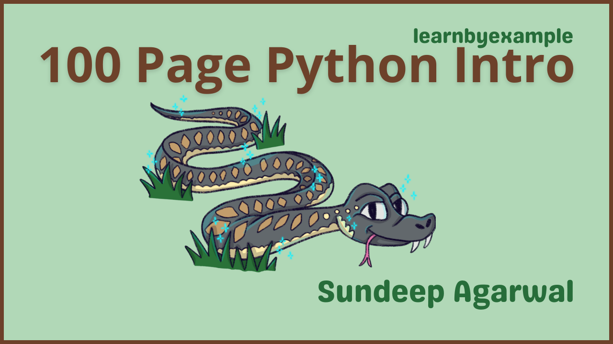

# 100 Page Python Intro

This book is a short, introductory guide for those already familiar with programming basics. Visit https://youtu.be/aoWJzaSs0cs for a short video about the book.

The book also includes exercises to test your understanding, which are presented together as a single file in this repo — [Exercises.md](./exercises/Exercises.md).

You can also use [this interactive TUI app](https://github.com/learnbyexample/TUI-apps/tree/main/PythonExercises) to practice some of the exercises from the book.

See [Version_changes.md](./Version_changes.md) to keep track of changes made to the book.

 

# E-book

* You can purchase the pdf/epub versions of the book using these links:
    * https://leanpub.com/100pagepythonintro
    * https://learnbyexample.gumroad.com/l/100pagepythonintro
* You can also get the book as part of these bundles:
    * **All books bundle** bundle from https://leanpub.com/b/learnbyexample-all-books or https://learnbyexample.gumroad.com/l/all-books
    * **Learn by example Python bundle** from https://leanpub.com/b/python-bundle or https://learnbyexample.gumroad.com/l/python-bundle
* See https://learnbyexample.github.io/books/ for a list of other books

For a preview of the book, see [sample chapters](./sample_chapters/100_page_python_intro_sample.pdf).

The book can also be [viewed as a single markdown file in this repo](./100_page_python_intro.md). See my blogpost on [generating pdf/epub from markdown using pandoc](https://learnbyexample.github.io/customizing-pandoc/) if you are interested in the ebook creation process.

For the web version of the book, visit https://learnbyexample.github.io/100_page_python_intro/

 

# Testimonials

>It's very thorough, written with care, and presented in a way that makes sense. Even as an intermediate Python programmer, I found use in this book.
>
> — feedback by [Andrew Healey](https://healeycodes.com/) on [Hacker News](https://news.ycombinator.com/item?id=26082464)

 

# Feedback and Contributing

⚠️ ⚠️ Please DO NOT submit pull requests. Main reason being any modification requires changes in multiple places.

I would highly appreciate it if you'd let me know how you felt about this book. It could be anything from a simple thank you, pointing out a typo, mistakes in code snippets, which aspects of the book worked for you (or didn't!) and so on. Reader feedback is essential and especially so for self-published authors.

You can reach me via:

* Issue Manager: [https://github.com/learnbyexample/100_page_python_intro/issues](https://github.com/learnbyexample/100_page_python_intro/issues)
* E-mail: `echo 'bGVhcm5ieWV4YW1wbGUubmV0QGdtYWlsLmNvbQo=' | base64 --decode`
* Twitter: [https://twitter.com/learn_byexample](https://twitter.com/learn_byexample)

 

# Table of Contents

1. Preface
2. Introduction
3. Numeric data types
4. Strings and user input
5. Defining functions
6. Control structures
7. Importing and creating modules
8. Installing modules and Virtual environments
9. Exception handling
10. Debugging
11. Testing
12. Tuple and Sequence operations
13. List
14. Mutability
15. Dict
16. Set
17. Text processing
18. Comprehensions and Generator expressions
19. Dealing with files
20. Executing external commands
21. Command line arguments

 

# Acknowledgements

* [Official Python website](https://docs.python.org/3/) — documentation and examples
* [stackoverflow](https://stackoverflow.com/) and [unix.stackexchange](https://unix.stackexchange.com/) — for getting answers to pertinent questions on Python, Shell and programming in general
* [/r/learnpython](https://old.reddit.com/r/learnpython) and [/r/learnprogramming](https://old.reddit.com/r/learnprogramming) — helpful forum for beginners
* [/r/Python/](https://old.reddit.com/r/Python/) — general Python discussion
* [tex.stackexchange](https://tex.stackexchange.com/) — for help on [pandoc](https://github.com/jgm/pandoc/) and `tex` related questions
* [canva](https://www.canva.com/) — cover image
* [oxipng](https://github.com/shssoichiro/oxipng), [pngquant](https://pngquant.org/) and [svgcleaner](https://github.com/RazrFalcon/svgcleaner) — optimizing images
* [Warning](https://commons.wikimedia.org/wiki/File:Warning_icon.svg) and [Info](https://commons.wikimedia.org/wiki/File:Info_icon_002.svg) icons by [Amada44](https://commons.wikimedia.org/wiki/User:Amada44) under public domain
* **Dean Clark** and **Elijah** for catching a few typos
* [mdBook](https://github.com/rust-lang/mdBook) — for web version of the book
    * [mdBook-pagetoc](https://github.com/JorelAli/mdBook-pagetoc) — for adding table of contents for each chapter
    * [minify-html](https://github.com/wilsonzlin/minify-html) — for minifying html files

 

# License

The book is licensed under a [Creative Commons Attribution-NonCommercial-ShareAlike 4.0 International License](https://creativecommons.org/licenses/by-nc-sa/4.0/).

The code snippets are licensed under MIT, see [LICENSE](./LICENSE) file.

